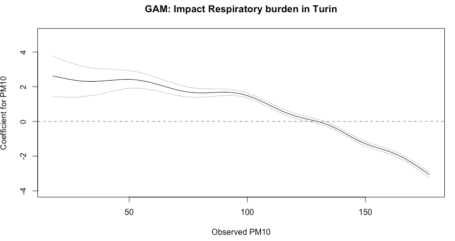
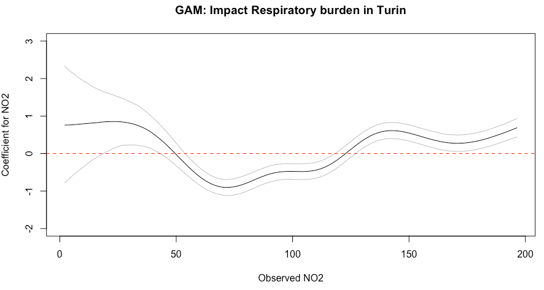

# Bayesian Generalised Additive Models (GAMs)

## Lecture recording (Length: 38:12 minutes)
```{r, warnings=FALSE, message=FALSE, echo=FALSE}
library(vembedr)
embed_msstream('e993c402-65a9-4b02-a67a-5facda574b3b', height=400) %>% use_align('center')
```

<div class="note">
**Important Notes:** If this or any subsequent video don't play from this website, then try playing it directly from Microsoft Streams - you should be able to view it by clicking this [**[LINK]**](https://web.microsoftstream.com/video/e993c402-65a9-4b02-a67a-5facda574b3b). Access to Microsoft Steams to these videos will require use of your UCL institutional login details.
</div>

## Introduction

To date, we have been using various models that considers the relationship between variables to be assumed as something that's **linear**. When implementing a regression of any kind, we are attempting to fit a straight line (i.e., line of best fit) to the data in order to examine and explain variations between two or more variables with some outcome with the strong assumption of linearity. The issue of linearity may not be case (which often is not the case) and hence there must be some model that can model **non-linear** relationships. This is where **Generalised Additive Models (GAMs)** come to play - this week we will learn how to use GAMs, within a **Bayesian** framework. 

This approach is incredibly easy to perform in RStudio as there are useful packages that generates the Stan code for GAMs. Let us begin! 

### Datasets & setting up the work directory 

Go to your folder **GEOG0125** and create a sub folder called "**Week 3**" within the **GEOG0125** folder. Here, we will store all our R & Stan scripts as well as datasets. Set your work directory to **Week 3's** folder.

For Windows, the code for setting the work directory will be:

```{r, eval = FALSE}
setwd("C:/Users/AccountName/Desktop/GEOG0125/Week 3")
```

For MAC, the code for setting the work directory will be:

```{r, eval = FALSE}
setwd("/Users/AccountName/Desktop/GEOG0125/Week 3")
```

The dataset for this practical are:

- `Respiratory Illness in Turin Province.csv`

Now, load the dataset:

```{r, eval=FALSE}
# load up the data
respiratory_data <- read.csv("Respiratory Illness in Turin Province.csv")
```

It contains the information taught in today's lecture. We will reproduce the analysis. 

### Loading and installing packages

Install the following packages for today's practicals.

```{r, eval = FALSE}
# install the following packages
install.packages("brms")
install.packages("mgcv")
install.packages("devtools")
install.packages("ggplot2")
devtools::install_github('gavinsimpson/schoenberg')
```

Now load the installed packages including `rstan`:

```{r, eval = FALSE}
# load up packages
library("brms")
library("mgcv")
library("ggplot2")
library("schoenberg")
library("rstan")
```

Make sure to select the appropriate number of cores on your computer - as this will preset the number of chains for the analysis.

```{r, eval = FALSE}
parallel::detectCores()
```

On my computer, it is six. Make sure to take note on what you number of cores are. Now the usual, configure Stan:

```{r, eval = FALSE}
# configure Stan
options(mc.cores = parallel::detectCores())
rstan_options(auto_write = TRUE)
```

## Implementing a Bayesian Generalised Additive Model

Coding a GAM model is extremely hard but lucky - we have the `brms` package which stands for **Bayesian Regression Modelling in Stan**. It has a very streamlined function `brm()` for executing a Bayesian model by calling Stan without the need to actually it in Stan, making it very easy. 

In fact, it even helps us to determine prior distributions for the parameters we want to estimate from our GAM model. All we need is to write the formula in the `get_prior()`:

```{r, eval=FALSE}
# get prior
prior.list <- get_prior(Overall ~ s(PM10) + s(CO) + s(NO2), data = respiratory_data, family = poisson())
```

This equation: `Overall ~ s(PM10) + s(CO) + s(NO2)` is our statistical model which follows a `poisson()` function. Notice the `s()` is wrapped round our independent variables. That is how we specify a smoother on an variable. In this example, we are applying smoothers to all independent variables.

We can run a GAM using the `brms()`. It like running the `ls()`.

```{r, eval=FALSE}
# start timer gauge how long it takes to run a GAM
ptm <- proc.time()

# run a GAM model
model.bayes.gam <- brm(bf(Overall ~ s(PM10) + s(CO) + s(NO2)),
	data = respiratory_data, 
	family = poisson(),
	prior = prior.list,
	cores = 6, # replace this with number of cores on your own machine
	iter = 8000, 
	warmup = 1000, 
	thin = 10, 
	refresh = 0,
	control = list(adapt_delta = 0.99))

# Stop the clock
proc.time() - ptm
```

It takes approximately `9 mins` to complete the computation of the sample posterior. We can visualise the results using the `summary()` function:

```{r, eval=FALSE}
# Report results
summary(model.bayes.gam)
```

**Summary Output [See slides 24]**

```{r, eval=FALSE, highlight=FALSE}
Family: poisson 
  Links: mu = log 
Formula: Overall ~ s(PM10) + s(CO) + s(NO2) 
   Data: respiratory_data (Number of observations: 315) 
  Draws: 4 chains, each with iter = 8000; warmup = 1000; thin = 10;
         total post-warmup draws = 2800

Smooth Terms: 
             Estimate Est.Error l-95% CI u-95% CI Rhat Bulk_ESS Tail_ESS
sds(sPM10_1)     6.57      1.91     3.92    11.63 1.01      400      827
sds(sCO_1)       5.83      1.60     3.72     9.77 1.01      295      551
sds(sNO2_1)      6.30      1.60     4.00    10.03 1.01      430     1016

Population-Level Effects: 
          Estimate Est.Error l-95% CI u-95% CI Rhat Bulk_ESS Tail_ESS
Intercept     3.56      0.01     3.54     3.59 1.00     1565     2241
sPM10_1     -19.46      3.40   -26.25   -12.94 1.01      445      906
sCO_1        33.75      3.17    27.43    39.90 1.01      396      804
sNO2_1        4.35      4.96    -5.43    14.39 1.01      259      455

Draws were sampled using sampling(NUTS). For each parameter, Bulk_ESS
and Tail_ESS are effective sample size measures, and Rhat is the potential
scale reduction factor on split chains (at convergence, Rhat = 1).
```

- The result under the **Smooth Terms** are variance parameters, which describes the extent of “wiggliness” of the smooth — the larger the value the more wigglier the smooth, and vice versa. We can see that the credible interval doesn’t include 0 so there is evidence that a smooth is required over and above a linear. If it did exclude the null value of zero - then it would mean there's no need to apply a smoother on that variable. Here, it was correct for us to apply a GAM model on these three variables. Also, the model is valid since the Rhat estimates that are below 1.05

- The result under the **Population-level effects** are simply global estimates which are considered as fixed effects. We will interpret these as we usually interpret a regression the usual way.

The above table essentially produces overall results. But we want the coefficient-specific estimate for each value measured in our independent variable. We can extract this result from `model.bayes.gam` object using the `conditional_smooths()` function.

```{r, eval=FALSE}
smooth_plot <- conditional_smooths(model.bayes.gam)
```

Run the following code in console: 

```{r, eval=FALSE}
smooth_plot$`mu: s(PM10)`
```

This should show the posterior specific estimates for `PM10`:

```{r, eval=FALSE, highlight=FALSE}
         PM10 effect1__ cond__  estimate__       se__       lower__     upper__
1    17.63150  17.63150      1  2.62097348 0.58419108  1.4172802112  3.78413878
2    19.24250  19.24250      1  2.57521132 0.56128002  1.4271478599  3.67997666
3    20.85350  20.85350      1  2.53090840 0.54322413  1.4125906851  3.59283584
4    22.46449  22.46449      1  2.48331531 0.52194251  1.4022329526  3.51408796
5    24.07549  24.07549      1  2.44123786 0.50497874  1.3973972175  3.43957333
6    25.68649  25.68649      1  2.40463959 0.48327388  1.3978011917  3.36643850
7    27.29749  27.29749      1  2.37041186 0.47086036  1.3958640356  3.28785824
8    28.90848  28.90848      1  2.34151285 0.45395873  1.4096217561  3.21844181
9    30.51948  30.51948      1  2.32250696 0.43903983  1.4396053597  3.17590372
10   32.13048  32.13048      1  2.31045468 0.42353149  1.4655908589  3.13094097
11   33.74148  33.74148      1  2.30418617 0.40966546  1.4872374125  3.09568692
12   35.35247  35.35247      1  2.30994093 0.39628829  1.5180691767  3.07073513
13   36.96347  36.96347      1  2.31814000 0.38190394  1.5579488275  3.04882364
14   38.57447  38.57447      1  2.33250802 0.37203591  1.6000727952  3.03712395
15   40.18547  40.18547      1  2.35002277 0.35667034  1.6531294642  3.02495744
16   41.79646  41.79646      1  2.36561240 0.33989502  1.7079949755  3.01680741
17   43.40746  43.40746      1  2.38308174 0.32717131  1.7585588559  3.00095344
18   45.01846  45.01846      1  2.40230261 0.31269355  1.7996081811  2.98990205
19   46.62946  46.62946      1  2.41608040 0.29657785  1.8450409374  2.97535575
20   48.24045  48.24045      1  2.42229899 0.27875546  1.8825763877  2.95464690
21   49.85145  49.85145      1  2.42185750 0.26111552  1.9082253754  2.92646095
22   51.46245  51.46245      1  2.41606038 0.24644429  1.9248348118  2.89337966
23   53.07345  53.07345      1  2.39506092 0.23390482  1.9218254499  2.85807943
24   54.68444  54.68444      1  2.36402488 0.22431384  1.9093917777  2.81362396
25   56.29544  56.29544      1  2.32589212 0.21393800  1.8852152209  2.75454643
26   57.90644  57.90644      1  2.28190391 0.20780909  1.8571817966  2.69251749
27   59.51744  59.51744      1  2.23039023 0.19945464  1.8244201954  2.62279135
28   61.12843  61.12843      1  2.17075723 0.18810909  1.7807092880  2.55284812
29   62.73943  62.73943      1  2.10757795 0.18250459  1.7312261291  2.47443043
30   64.35043  64.35043      1  2.04432131 0.17743278  1.6808230354  2.40017233
31   65.96143  65.96143      1  1.97719004 0.17271403  1.6317107455  2.32570753
32   67.57242  67.57242      1  1.91449416 0.16605060  1.5832596809  2.24791409
33   69.18342  69.18342      1  1.85511399 0.16055720  1.5309816170  2.18115654
34   70.79442  70.79442      1  1.80101939 0.15951536  1.4875723704  2.11322875
35   72.40542  72.40542      1  1.75231598 0.15434167  1.4482471767  2.05785024
36   74.01641  74.01641      1  1.71355011 0.14961617  1.4179592295  2.00578986
37   75.62741  75.62741      1  1.68147066 0.14388785  1.3995074794  1.96245797
38   77.23841  77.23841      1  1.65967140 0.13853479  1.3882695320  1.93246780
39   78.84941  78.84941      1  1.64791200 0.13459759  1.3858286175  1.90978707
40   80.46040  80.46040      1  1.64336048 0.12875041  1.3908758754  1.89325457
41   82.07140  82.07140      1  1.64492013 0.12268128  1.4031639860  1.88175612
42   83.68240  83.68240      1  1.65417851 0.11713959  1.4235300062  1.87808877
43   85.29340  85.29340      1  1.66470527 0.11034031  1.4449902794  1.87569038
44   86.90439  86.90439      1  1.67664542 0.10498627  1.4690518449  1.87324834
45   88.51539  88.51539      1  1.68465372 0.10091327  1.4884726332  1.87169557
46   90.12639  90.12639      1  1.68897643 0.09330719  1.5035928627  1.87098835
47   91.73739  91.73739      1  1.68347289 0.08683769  1.5096123619  1.85667260
48   93.34838  93.34838      1  1.67060921 0.08271990  1.5076451208  1.83537867
49   94.95938  94.95938      1  1.64464120 0.07771426  1.4903394988  1.80144760
50   96.57038  96.57038      1  1.60848980 0.07453532  1.4585948072  1.76077187
51   98.18138  98.18138      1  1.56015919 0.07375575  1.4156532522  1.70600263
52   99.79237  99.79237      1  1.49690657 0.07238988  1.3603992597  1.64393361
53  101.40337 101.40337      1  1.42440125 0.07373672  1.2907121958  1.57108031
54  103.01437 103.01437      1  1.34150729 0.07264463  1.2096780201  1.49012333
55  104.62537 104.62537      1  1.24797093 0.07222848  1.1135088788  1.39686834
56  106.23636 106.23636      1  1.14710058 0.07207578  1.0121126540  1.29687463
57  107.84736 107.84736      1  1.04280793 0.07222129  0.9058132254  1.19160851
58  109.45836 109.45836      1  0.93526416 0.07258752  0.7972667841  1.08526921
59  111.06936 111.06936      1  0.82787351 0.07342898  0.6888869747  0.97590446
60  112.68035 112.68035      1  0.72334638 0.07249049  0.5850385387  0.87003656
61  114.29135 114.29135      1  0.62353761 0.07184606  0.4844786298  0.76856511
62  115.90235 115.90235      1  0.52968239 0.07181101  0.3905574540  0.67239135
63  117.51335 117.51335      1  0.44344659 0.07074263  0.3038719320  0.58689049
64  119.12434 119.12434      1  0.36603452 0.07036476  0.2283629332  0.50649586
65  120.73534 120.73534      1  0.29648469 0.06876687  0.1594488329  0.43632890
66  122.34634 122.34634      1  0.23554247 0.06794464  0.1006475466  0.37354216
67  123.95734 123.95734      1  0.18000095 0.06758691  0.0497623523  0.31633100
68  125.56833 125.56833      1  0.13053101 0.06618215  0.0007378314  0.26424762
69  127.17933 127.17933      1  0.08206403 0.06474997 -0.0467437618  0.21423914
70  128.79033 128.79033      1  0.03134801 0.06480924 -0.0974891106  0.16225348
71  130.40133 130.40133      1 -0.02507498 0.06446464 -0.1533213958  0.10484075
72  132.01232 132.01232      1 -0.08949573 0.06458059 -0.2185494998  0.04043094
73  133.62332 133.62332      1 -0.16544886 0.06520103 -0.2941522813 -0.03573511
74  135.23432 135.23432      1 -0.25395271 0.06544914 -0.3823353866 -0.12530644
75  136.84532 136.84532      1 -0.35452839 0.06517862 -0.4834635198 -0.22497655
76  138.45631 138.45631      1 -0.46556823 0.06511143 -0.5947961412 -0.33433084
77  140.06731 140.06731      1 -0.58572483 0.06552576 -0.7145562107 -0.45392189
78  141.67831 141.67831      1 -0.71021821 0.06659227 -0.8374210177 -0.57922044
79  143.28931 143.28931      1 -0.83427326 0.06712725 -0.9628190317 -0.70353029
80  144.90030 144.90030      1 -0.95489071 0.06664170 -1.0866594998 -0.82278030
81  146.51130 146.51130      1 -1.06836138 0.06723713 -1.2009492109 -0.93596858
82  148.12230 148.12230      1 -1.17158620 0.06741626 -1.3056400369 -1.03885479
83  149.73330 149.73330      1 -1.26424326 0.06818362 -1.3967667804 -1.13022022
84  151.34429 151.34429      1 -1.34683285 0.06863472 -1.4788035367 -1.21287485
85  152.95529 152.95529      1 -1.42127536 0.06919206 -1.5539866490 -1.28840211
86  154.56629 154.56629      1 -1.49103166 0.06843476 -1.6244977766 -1.35811880
87  156.17729 156.17729      1 -1.55861848 0.06932546 -1.6943199126 -1.42259813
88  157.78828 157.78828      1 -1.62686300 0.06936522 -1.7642742006 -1.49149207
89  159.39928 159.39928      1 -1.69919472 0.06909321 -1.8378600178 -1.56336851
90  161.01028 161.01028      1 -1.77983166 0.06959826 -1.9187291284 -1.64353354
91  162.62128 162.62128      1 -1.86963932 0.06948871 -2.0093699789 -1.73373903
92  164.23228 164.23228      1 -1.96957576 0.07001212 -2.1119305781 -1.83262600
93  165.84327 165.84327      1 -2.08094069 0.07075931 -2.2247677724 -1.94291702
94  167.45427 167.45427      1 -2.20301138 0.07164868 -2.3493314976 -2.06646808
95  169.06527 169.06527      1 -2.33352869 0.07203991 -2.4810339237 -2.19639859
96  170.67627 170.67627      1 -2.47199154 0.07320017 -2.6211551967 -2.33402310
97  172.28726 172.28726      1 -2.61514938 0.07559344 -2.7664659941 -2.47323472
98  173.89826 173.89826      1 -2.76218030 0.07684584 -2.9162540724 -2.61667948
99  175.50926 175.50926      1 -2.91141448 0.08046156 -3.0699949230 -2.76090593
100 177.12026 177.12026      1 -3.06126468 0.08357851 -3.2261306757 -2.90331811
```

We will extract the column 1, 4, 6 and 7 in order to graph the coefficients against the PM10. This essentially tells us the impact of PM10 on admissions for all values of PM10. Column is the observed sampled PM10, column 4 is our coefficients estimated from our basis function (see lecture), and column 6 and 7 is our lower and upper credibility intervals.

Here is the code for extracting the columns for the `model.bayes.gam` object:

```{r, eval=FALSE}
# create a data frame
beta_coef_PM10 <- data.frame(pm10 = smooth_plot$`mu: s(PM10)`[1], beta = smooth_plot$`mu: s(PM10)`[4], 
	lower = smooth_plot$`mu: s(PM10)`[6], lower = smooth_plot$`mu: s(PM10)`[7])
```

Now, we will plot our final output for PM10 and its impact on respiratory admission:

```{r, eval=FALSE}
# generate a plot with coefficients and PM10
plot(beta_coef_PM10$PM10, beta_coef_PM10$estimate__, type="l",
	ylab = "Coefficient for PM10", xlab="Observed PM10", ylim=c(-4, 5),
	main = "GAM: Impact Respiratory burden in Turin")
# Add lines for 95% credibility limits to above graph
lines(beta_coef_PM10$PM10, beta_coef_PM10$upper__,col="grey")
lines(beta_coef_PM10$PM10, beta_coef_PM10$lower__,col="grey")
# Add null value line at origin
abline(h=0, lty = "dashed", col ="red")
```

**Figure output**
```{r echo=FALSE, out.width = "100%", fig.align='center', cache=TRUE,}
 
```

- **Interpretation**: The overall impact of PM10 on respiratory-related admissions show a significant decreasing trend across it's values (-19.46, 95% CrI: -26.25 to -12.94). However, it should be noted that PM10 levels up to 125 yields a significant increase in the admission rates; whilst values after 133 yields a significant decrease in admission rates.    

We can plot our final output for N02 and its impact on respiratory admission as well:

```{r, eval=FALSE}
# extract posterior estimates and values for NO2 & create a data frame
beta_coef_NO2 <- data.frame(no2 = smooth_plot$`mu: s(NO2)`[1], beta = smooth_plot$`mu: s(NO2)`[4], 
	lower = smooth_plot$`mu: s(NO2)`[6], lower = smooth_plot$`mu: s(NO2)`[7])
# generate a plot with coefficients and NO2
plot(beta_coef_NO2$NO2, beta_coef_NO2$estimate__, type="l",
	ylab = "Coefficient for NO2", xlab="Observed NO2", ylim=c(-2, 3),
	main = "GAM: Impact Respiratory burden in Turin")
# add 95% credibility limits
lines(beta_coef_NO2$NO2, beta_coef_NO2$upper__,col="grey")
lines(beta_coef_NO2$NO2, beta_coef_NO2$lower__,col="grey")
# Add null value
abline(h=0, lty = "dashed", col ="red")
```

**Figure output**
```{r echo=FALSE, out.width = "100%", fig.align='center', cache=TRUE,}

```

- **Interpretation**: The overall impact of N02 on respiratory-related admissions show an increasing trend across it's values that is not signficant (4.35, 95% CrI: -5.43 to 14.39). The overall patterns can be described as U-shaped. It should be noted that the NO2 levels between 19.72 and 41.32, and past 127 yields a significant increase in the admission rates; whilst values between 55.06 to 117 yields a significant decrease in admission rates.

## Printing Stan code from `brms::stancode()`

The Stan code for the GAM model can be printed using the `stancode` function:

```{r, eval=FALSE}
# This prints the stancode
stancode(model.bayes.gam)
```

**Printed Stan Code**
```{r, eval=FALSE, highlight=FALSE}
// generated with brms 2.18.0
functions {
}
data {
  int<lower=1> N;  // total number of observations
  int Y[N];  // response variable
  // data for splines
  int Ks;  // number of linear effects
  matrix[N, Ks] Xs;  // design matrix for the linear effects
  // data for spline s(PM10)
  int nb_1;  // number of bases
  int knots_1[nb_1];  // number of knots
  // basis function matrices
  matrix[N, knots_1[1]] Zs_1_1;
  // data for spline s(CO)
  int nb_2;  // number of bases
  int knots_2[nb_2];  // number of knots
  // basis function matrices
  matrix[N, knots_2[1]] Zs_2_1;
  // data for spline s(NO2)
  int nb_3;  // number of bases
  int knots_3[nb_3];  // number of knots
  // basis function matrices
  matrix[N, knots_3[1]] Zs_3_1;
  int prior_only;  // should the likelihood be ignored?
}
transformed data {
}
parameters {
  real Intercept;  // temporary intercept for centered predictors
  vector[Ks] bs;  // spline coefficients
  // parameters for spline s(PM10)
  // standarized spline coefficients
  vector[knots_1[1]] zs_1_1;
  real<lower=0> sds_1_1;  // standard deviations of spline coefficients
  // parameters for spline s(CO)
  // standarized spline coefficients
  vector[knots_2[1]] zs_2_1;
  real<lower=0> sds_2_1;  // standard deviations of spline coefficients
  // parameters for spline s(NO2)
  // standarized spline coefficients
  vector[knots_3[1]] zs_3_1;
  real<lower=0> sds_3_1;  // standard deviations of spline coefficients
}
transformed parameters {
  // actual spline coefficients
  vector[knots_1[1]] s_1_1;
  // actual spline coefficients
  vector[knots_2[1]] s_2_1;
  // actual spline coefficients
  vector[knots_3[1]] s_3_1;
  real lprior = 0;  // prior contributions to the log posterior
  // compute actual spline coefficients
  s_1_1 = sds_1_1 * zs_1_1;
  // compute actual spline coefficients
  s_2_1 = sds_2_1 * zs_2_1;
  // compute actual spline coefficients
  s_3_1 = sds_3_1 * zs_3_1;
  lprior += student_t_lpdf(Intercept | 3, 3, 2.5);
  lprior += student_t_lpdf(sds_1_1 | 3, 0, 2.5)
    - 1 * student_t_lccdf(0 | 3, 0, 2.5);
  lprior += student_t_lpdf(sds_2_1 | 3, 0, 2.5)
    - 1 * student_t_lccdf(0 | 3, 0, 2.5);
  lprior += student_t_lpdf(sds_3_1 | 3, 0, 2.5)
    - 1 * student_t_lccdf(0 | 3, 0, 2.5);
}
model {
  // likelihood including constants
  if (!prior_only) {
    // initialize linear predictor term
    vector[N] mu = rep_vector(0.0, N);
    mu += Intercept + Xs * bs + Zs_1_1 * s_1_1 + Zs_2_1 * s_2_1 + Zs_3_1 * s_3_1;
    target += poisson_log_lpmf(Y | mu);
  }
  // priors including constants
  target += lprior;
  target += std_normal_lpdf(zs_1_1);
  target += std_normal_lpdf(zs_2_1);
  target += std_normal_lpdf(zs_3_1);
}
generated quantities {
  // actual population-level intercept
  real b_Intercept = Intercept;
}

```
