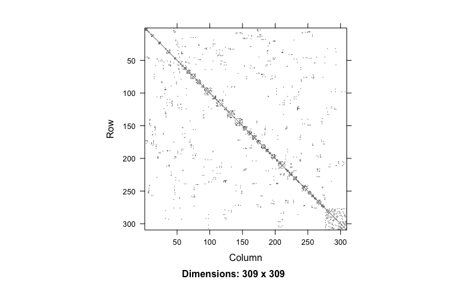
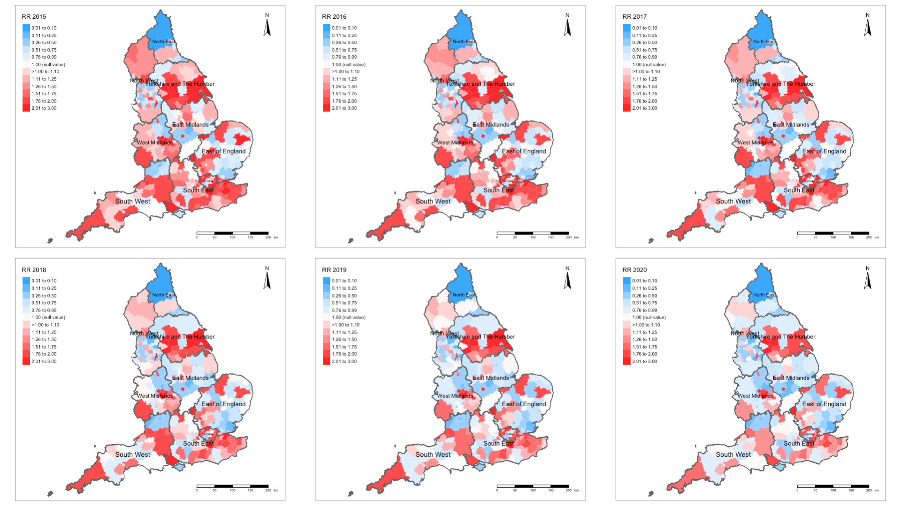
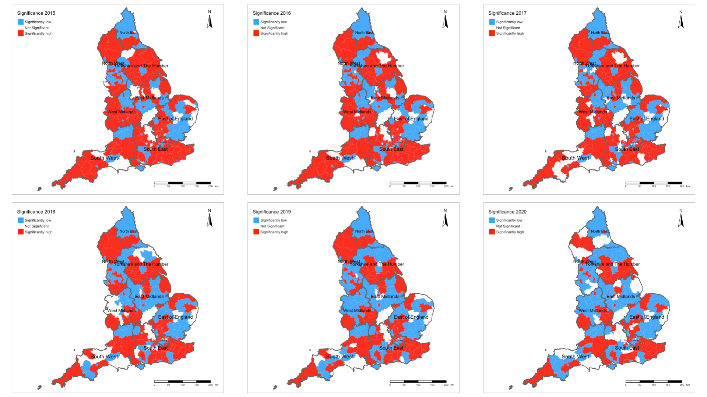

# Bayesian Updating & Spatial Temporal Modelling

## Introduction

This week's practical is in two parts: a.) **Bayesian Updating in R-Stan**; and b.) **Spatial Temporal Modelling in R-INLA**. Brace yourself - this tutorial is quite comprehensive. So let's begin! 

## Part 1: Bayesian Updating

This section will show how to apply **Bayesian Updating** to the spatial ICAR model. This approach excellent for analyzing data that is received in separate streams on a ‘regular’ or ‘irregular’ basis. It is highly suitable for use within a **repeated cross-sectional** analytical framework. The definition of **Bayesian Updating** is a statistical method for revising the estimated probabilities about the events you have observed previously, and this revision is based on new evidence (i.e., new data).

The learning outcomes for this section, we will see how to apply this technique to mosquito surveillance data to provide the following:

- An update on the risk profile of neighbourhoods;
- See how the risk parameters evolve in the face of new data;
- The main goal is show you the process of updating and data managing in that aspect;

### Loading and installing packages

Now, lets load all packages needed specifically for this computer practical:

```{r, eval = FALSE}
# Load the packages with library()
library("sf")
library("tmap")
library("spdep")
library("rstan")
library("geostan")
library("SpatialEpi")
library("tidybayes")
library("tidyverse")
```

As usual, upon loading the `rstan` package, it is highly recommended to run this code to configure the settings in RStudio:

```{r, eval=FALSE}
options(mc.cores = parallel::detectCores())
rstan_options(auto_write = TRUE)
```

This will tell RStudio to use the multiple cores in your computer for parallel processing whenever Stan is being used. Every time you want to use Stan - make sure to load the above `parallel::detectCores()` and `rstan_options` codes.

### Datasets & setting up the work directory 

Go to your folder **GEOG0125** and create a sub folder called "**Week 9**" within the **GEOG0125** folder. Here, we will store all our R & Stan scripts as well as datasets. Set your work directory to **Week 9's** folder.

For Windows, the code for setting the work directory will be:

```{r, eval = FALSE}
setwd("C:/Users/AccountName/Desktop/GEOG0125/Week 9")
```

For MAC, the code for setting the work directory will be:

```{r, eval = FALSE}
setwd("/Users/AccountName/Desktop/GEOG0125/Week 9")
```

The dataset for this section of the practical are:

- `Lira_January_2017.csv`
- `Lira_April_2017.csv`
- `Lira_July_2017.csv`
- `Campina_Grande_Lira2017.shp`

The surveillance and environmental information are contained in monthly LIRA files. The spatial configuration is the shape file for Campina Grande (Brazil). 

- The Campina Grande shape file contains 47 neighbourhoods. The unique identifiers, neighbourhood number and names are defined under the columns `osmID`, `NeighbNum` and `NeighbNam` respectively;
- Across the January, April and July datasets for LIRA 2017. It contains the following variables: `osmID`, `NeighbNum` and `NeighbNam` to link with the shape file. The `InfestedNum` is the **dependent variable** that represents the number of households identified as infested with mosquito breeding habitats in a neighbourhood. The column `Total` is the total number of households in a neighbourhood. It was used to compute **expected number** of infested households. This will be used as an offset in the Bayesian model. Lastly, the following `Temperature`, `Precipitation`, `NDVI` and `Urbanisation` are the **independent** variables.

Let us load these dataset to memory:

```{r, eval=FALSE}
# load the data sets
Lira2017_1 <- read.csv("Lira_January_2017.csv")
Lira2017_2 <- read.csv("Lira_April_2017.csv")
Lira2017_3 <- read.csv("Lira_July_2017.csv")

# load the shapefile
campina_grande_neighbourhoods <- read_sf("Campina_Grande_Lira2017.shp")
```

<div class = "note">
**Important note:** Most of the data management and cleaning has been done. This practical will only show important cleaning steps.  
</div>

### Data preparation in RStudio

#### Converting the spatial adjacency matrix to nodes & edges

We will need to derive a set a list of nodes and edges accordingly as Stan can only identify a spatial adjacency with a set of paired nodes with edges that connect them all together. For instance, `node1` represents the index region and `node2` is a list of neighbouring regions connected to the index region in `node1` (see [**section 6.6.2, Week 8**](https://uclpg-msc-sgds.github.io/GEOG0125/bayesian-spatial-modelling-for-areal-data-in-stan.html#converting-the-spatial-adjacency-matrix-to-nodes-edges)).

We can perform this spatial operation by first coercing the `sf` simple features object (i.e., `campina_grande_neighbourhoods`) to be to the spatial object `sp`.

Here is the code:

```{r, eval=FALSE}
# coerced to a "sp" object
campina_grande_neighb_spobject <- as(campina_grande_neighbourhoods, "Spatial")
```

Now, we are going to derive the **nodes** and **edges** from the `campina_grande_neighb_spobject` using the `shape2mat()` function - this changes it into a matrix object. From the matrix object, we will be able to prepare the data from spatial ICAR model using the `prep_icar_data()` function. Here, is the code:

```{r, eval=FALSE}
# coerced into a "matrix" object
adjacencyMatrix <- shape2mat(campina_grande_neighb_spobject)
# we will need to extract the components for the ICAR model when setting up the data set for Stan
extractComponents <- prep_icar_data(adjacencyMatrix)
```

From the `extractComponents` object, we will need to extract the following contents:

- `$group_size` this is the number of areal units under observation listed in the shapefile (should be the same in the LIRA dataset)
- `$node1` are index neighbourhood of interest
- `$node2` are the other neighbouring neighbourhoods that are connected to the index neighbourhood of interest listed in `node1`
- `$n_edges` creates the network as show area is connected to what neighbourhood. It is still an adjacency matrix using the queen contiguity matrix but as a network since Stan can only use this structure.

Here is the code for performing the extraction:

```{r, eval=FALSE}
n <- as.numeric(extractComponents$group_size)
nod1 <- extractComponents$node1
nod2 <- extractComponents$node2
n_edges <- as.numeric(extractComponents$n_edges)
```

Note that the information needed are stored in `n`, `nod1`, `nod2` and `n_edges`.

#### Creating the baseline set of data for Stan

Next the step, we will need to prepare the data as a list object and define the variables needed to be compiled in Stan. The outcome `InfestedNum` is going to be made passed as `y`. The set of independent variables i.e., `Temperature`, `Precipitation`, `NDVI` and `Urbanisation` is going to be made as a **matrix** object called `x`, `K` is the number of independent variables i.e., 4, and the offset variable from the `Expected` will be extracted as `e`.

Here is the code:

```{r, eval=FALSE}
y=Lira2017_1$InfestedNum
x=Lira2017_1[,c(9,10,11,12)]
e=Lira2017_1$Expected
```

Now, we create our dataset for Stan:

```{r, eval=FALSE}
# put all components into a list object
stan.spatial.baseline <- list(N=n, N_edges=n_edges, node1=nod1, node2=nod2, Y=y, X=x, K=length(x), offset=e)
```

The above information is going to be passed to `data block` in Stan for compilation.

### Full Stan script for the Spatial ICAR model

We will use full script for executing the **spatial intrinsic conditional auto-regressive (ICAR) model**. This will be performed on the baseline dataset `stan.spatial.baseline`.

Please open a new Stan file and use the following codes:

```{r, eval=FALSE, highlight=FALSE}

// Stan script: Spatial ICAR Poisson model

data {
  int<lower=0> N;                                                        // number of spatial units or neighbourhoods in Campina Grande
  int<lower=0> N_edges;                                                  // number of edges connecting adjacent areas using Queens contiguity
  array[N_edges] int<lower=1, upper=N> node1;                            // list of index areas showing which spatial units are neighbours
  array[N_edges] int<lower=1, upper=N> node2;                            // list of neighbouring areas showing the connection to index spatial unit
  array[N] int<lower=0> Y;                                               // dependent variable i.e., number of households infested
  vector<lower=1>[N] offset;                                             // total number of houses in neoighbourhoods are used as an offset variable
  int<lower=1> K;                                                        // number of independent variables i.e., K = 4
  matrix[N, K] X;                                                        // independent variables in matrix form i.e., temp, prec, ndvi, and urban
}

transformed data {
	vector[N] log_offset = log(offset);
}

parameters {
  real alpha;                                                            // intercept
  vector[K] beta;                                                        // covariates
  real<lower=0> sigma;                                                   // overall standard deviation
  real<lower=0, upper=1> rho;                                            // proportion unstructured vs. spatially structured variance
  vector[N] theta;                                                       // unstructure random effects (heterogeneous)
  vector[N] phi;                                                         // spatial random effects
}

transformed parameters {
  vector[N] combined;                                                    // combined random effect i.e., unstructure and structured

  combined = sqrt(1 - rho) * theta + sqrt(rho) * phi;                    // formulation for the combined random effect i.e., unstructure and structured
}

model {
  Y ~ poisson_log(log_offset + alpha + X * beta + combined * sigma);     // likelihood function: multivariable Poisson ICAR regression model
  alpha ~ normal(0.0, 1.0);                                              // prior for alpha: weakly informative
  beta ~ normal(0.0, 1.0);                                               // prior for betas: weakly informative
  theta ~ normal(0.0, 1.0);                                              // prior for theta: weakly informative
  sigma ~ normal(0.0, 1.0);                                              // prior for sigma: weakly informative
  rho ~ beta(0.5, 0.5);                                                  // prior for rho: pulled for literature

  target += -0.5 * dot_self(phi[node1] - phi[node2]);                    // prior for phi: using a conditional autoregressive distribution
  sum(phi) ~ normal(0, 0.001 * N);                                       // soft sum-to-zero constraint on phi, and its the equivalent to mean(phi) ~ normal(0,0.001)
}

generated quantities {
  vector[N] eta = alpha + X * beta + combined * sigma;                  // compute eta and exponentiate into mu                   
  vector[N] rr_mu = exp(eta);                                           // output the neighbourhood-specific relative risks in mu
  vector[K] rr_beta = exp(beta);                                        // output the risk ratios for each coefficient for the independent variables
  real rr_alpha = exp(alpha);                                           // output the risk ratios for the intercept
}

```

Make sure to save the Stan script as `ICAR_model_baseline.stan` the working directory.

### Compiling Stan code for the Baseline ICAR model

Now, let us turn our attention back to RStudio. Use the `stan()` function to compile the saved script to obtain the posterior estimation of the parameters from our baseline model:

```{r, eval=FALSE}
ptm <- proc.time() # starts timer
Bayesian.model.baseline = stan("ICAR_model_baseline.stan", data=stan.spatial.baseline, iter=60000, chains=6, verbose = FALSE, control = list(max_treedepth = 12))
proc.time() - ptm  # stops and calculates how the model took to process with 60000 iterations on 6 cores
```

#### Rapid diagnostics

##### First check: **rHATs** are less than 1.05

Before interpreting the overall risks, as well as mapping them, we must check if there are any of the estimates i.e., `alpha`, `beta`, `sigma` and all `phi` whose **rHAT** exceed the threshold value of 1.05. 1.05 is a much tighter and strict estimate than 1.10. This is an indication that the iterations did not perform well if an `rHAT` for a parameter is above `1.05`. We can do a rapid checks to see which parameter is valid or not by creating a binary variable of `1`'s (i.e., Valid if `rHAT` < 1.05), otherwise `0`'s (Not valid). 

We can tabulate it to see the numbers:

```{r, eval=FALSE}
# diagnostic check on the rHats - put everything into a data frame
diagnostic.checks <- as.data.frame(summary(icar_poisson_fit, pars=c("alpha", "beta", "sigma", "phi", "lp__"), probs=c(0.025, 0.5, 0.975))$summary)
# create binary variable
diagnostic.checks$valid <- ifelse(diagnostic.checks$Rhat < 1.1, 1, 0)
# tabulate it
table(diagnostic.checks$valid)
```

Everything is okay - all outputted parameters have an `rHAT < 1.05`.

##### Second check: No evidence of divergence in the samples

We have computed a total of 360,000 iterations across the 6 chains, of which half the number is discarded. Hence, we have a sample of 180,000 posterior estimates. Now, we need to ensure that **at most** 10% of samples from the total has **NOT** diverged (<18,000 samples).

```{r, eval=FALSE}
# check across each chains for samples that have diverged (should not exceed 10% of the total 180000)
d1 <- get_sampler_params(Bayesian.model.baseline, inc_warmup = F)[[1]][, 'divergent__'] %>% sum() # chain 1
d2 <- get_sampler_params(Bayesian.model.baseline, inc_warmup = F)[[2]][, 'divergent__'] %>% sum() # chain 2
d3 <- get_sampler_params(Bayesian.model.baseline, inc_warmup = F)[[3]][, 'divergent__'] %>% sum() # chain 3
d4 <- get_sampler_params(Bayesian.model.baseline, inc_warmup = F)[[4]][, 'divergent__'] %>% sum() # chain 4
d5 <- get_sampler_params(Bayesian.model.baseline, inc_warmup = F)[[5]][, 'divergent__'] %>% sum() # chain 5
d6 <- get_sampler_params(Bayesian.model.baseline, inc_warmup = F)[[6]][, 'divergent__'] %>% sum() # chain 6

# Check the proportion of diverged samples
(d1+d2+d3+d4+d5+d6)/180000 * 100
```

Everything is okay - it seems that all samples converged.

We can now proceed to the extraction of our results!

<div class="note">
**NOTES**: To avoid such complications, it is always to best to run about `10000`, `15000` or more iterations. Usually, shorter iterations yield low effective sample sizes after thinning/warm-up samples are discarded, which in turn, may lead to complications that may cause the `rHAT` to be above 1.05, or samples that won't converge. Notice, how today we have used up to 60,000 iterations! 
</div>

#### Extraction of results to user-friendly format

We are going to extract the results from the baseline model object. Pay close attention to this section - it shows how to extract all the necessary information and building into a table to be inserted into a document.

##### Extract the exceedence probabilities for the independent variables

This section computes and extracts the exceedance probabilities for the intercept & each independent variable in the order of `Temperature`, `Precipitation`, `NDVI` and `Urbanisation`:

```{r, eval = FALSE}
# compute exceedance probability for the intercept
threshold.intercept <- function(x){mean(x > 0.00)}
alpha.exc.probs <- Bayesian.model.baseline %>% spread_draws(alpha) %>% 
	summarise(alpha=threshold.intercept(alpha)) %>%
	pull(alpha)

# compute exceedance probability for each of the independent variables.
threshold.coefficients <- function(x){mean(x > 0.00)}
beta.exc.probs <- Bayesian.model.baseline %>% spread_draws(beta[i]) %>% 
	group_by(i) %>% summarise(beta=threshold.coefficients(beta)) %>%
	pull(beta)

# reports exceedance probabilities
alpha.exc.probs
beta.exc.probs
```

<div class="note">
**NOTES**: The exceedance probabilities are as follows: intercept (0.462), `Temperature` (0.098), `Precipitation` (0.994), `NDVI` (0.317) and `Urbanisation` (0.627)
</div>

##### Building a table of results for the baseline regression model

This is hack code to prepare the results into something that's user-friendly:

```{r, eval = FALSE}
# Step 1: create the names in the appropriate order as there were modelled in Stan
names <- c("Intercept", "Temperature", "Precipitation", "NDVI", "Urbanisation")

# Step 2: now, pull all global relative risk results into the object called 'results'
results <- as.data.frame(summary(Bayesian.model.baseline, pars = c("rr_alpha", "rr_beta"), probs = c(0.025, 0.975))$summary)
results$variables <- names
row.names(results) <- 1:nrow(results)

# Step 3: fudge with the results to make it look clean
results <- results[,c(8, 1, 4, 5, 6, 7)]
results$mean <- round(results$mean, 4)
colnames(results)[2] <- "coefficient"
colnames(results)[3] <- "lower95"
colnames(results)[4] <- "upper95"
colnames(results)[5] <- "ess"
colnames(results)[6] <- "rhat"
results$lower95<- round(results$lower95, 4)
results$upper95 <- round(results$upper95, 4)
results$ess <- round(results$ess, 0)
results$rhat <- round(results$rhat, 4)

# Step 4: stitch the credibility results as text so it reads as (95% CrI: XXX to XXX)
results$beta_95CrI <- paste(results$coefficient, " (95% CrI: ", results$lower95, " to ", results$upper95, ")", sep = "")

# Step 5: pull the exceedance probabilities into the result table
a <- c(alpha.exc.probs, beta.exc.probs)
results$ExceedanceProb <- round(a, 4)
results$Uncertainty <- paste("Prob = ", results$ExceedanceProb, sep = "")

# Step 6: finally, more fudging around with the results to make it look cleaner and done!
final.output <- results[,c(1, 7, 9, 5, 6)]

# view final output and... presto! not too shabby!
final.output
```

The table with global results should look something like:

```{r, eval=FALSE, highlight=FALSE}
      variables                         beta_95CrI   Uncertainty    ess   rhat
1     Intercept   1.4885 (95% CrI: 0.13 to 6.3882) Prob = 0.4622 160464 1.0000
2   Temperature   0.93 (95% CrI: 0.8289 to 1.0393) Prob = 0.0982  76492 1.0001
3 Precipitation 1.1546 (95% CrI: 1.0342 to 1.2872) Prob = 0.9942  66703 1.0000
4          NDVI    0.93 (95% CrI: 0.625 to 1.3273) Prob = 0.3165 100842 1.0000
5  Urbanisation   1.181 (95% CrI: 0.564 to 2.1725) Prob = 0.6269  99644 1.0000
```

Now, preserve this **baseline** regression result in a spreadsheet:

```{r, eval=FALSE}
# Now export into a .csv file
write.csv(final.output, file = "Baseline_Result_January_2017.csv", row.names = FALSE)
```

##### Mapping the relative risk and significance for the baseline result

Same approach as Week 8 (sections [**6.83**](https://uclpg-msc-sgds.github.io/GEOG0125/bayesian-spatial-modelling-for-areal-data-in-stan.html#extraction-of-the-area-specific-relative-risks) and [**6.8.4**](https://uclpg-msc-sgds.github.io/GEOG0125/bayesian-spatial-modelling-for-areal-data-in-stan.html#mapping-of-rr-and-significance)). 

Extract the area-specific relative risks for the neighbourhoods:

```{r, eval=FALSE}
# extraction key posterior results for the generated quantities 
relativeRisk.results <- as.data.frame(summary(Bayesian.model.baseline, pars=c("rr_mu"), probs=c(0.025, 0.975))$summary)
# now cleaning up this table up
# first, insert clean row numbers to new data frame
row.names(relativeRisk.results) <- 1:nrow(relativeRisk.results)
# second, rearrange the columns into order
relativeRisk.results <- relativeRisk.results[, c(1,4,5,7)]
# third, rename the columns appropriately
colnames(relativeRisk.results)[1] <- "rr"
colnames(relativeRisk.results)[2] <- "rrlower"
colnames(relativeRisk.results)[3] <- "rrupper"
colnames(relativeRisk.results)[4] <- "rHAT"
```

Merge the results to the shapefile:

```{r, eval=FALSE}
# template for merging spatial risk data
spatial.data <- campina_grande_neighbourhoods
# now, we proceed to generate our risk maps
# align the results to the areas in shapefile
spatial.data$rr <- relativeRisk.results[, "rr"]
spatial.data$rrlower <- relativeRisk.results[, "rrlower"]
spatial.data$rrupper <- relativeRisk.results[, "rrupper"]
```

Create the significance categories:

```{r, eval=FALSE}
# create categories to define if an area has significant increase or decrease in risk, or nothing all 
spatial.data$Significance <- NA
spatial.data$Significance[spatial.data$rrlower<1 & spatial.data$rrupper>1] <- 0    # NOT SIGNIFICANT
spatial.data$Significance[spatial.data$rrlower==1 | spatial.data$rrupper==1] <- 0  # NOT SIGNIFICANT
spatial.data$Significance[spatial.data$rrlower>1 & spatial.data$rrupper>1] <- 1    # SIGNIFICANT INCREASE
spatial.data$Significance[spatial.data$rrlower<1 & spatial.data$rrupper<1] <- -1   # SIGNIFICANT DECREASE

# use these functions to understand the distribution of these risk estimates
summary(spatial.data$rr)
hist(spatial.data$rr)
table(spatial.data$Significance)
```

```{r, eval=FALSE, highlight=FALSE}
   Min. 1st Qu.  Median    Mean 3rd Qu.    Max. 
 0.7016  1.2039  1.8050  1.7336  2.3284  2.9318 
 
 -1  0  1 
 4 10 33
```

<div class="note">
**NOTES**: The relative estimates basically ranges from 0.70 to 2.93. There are 4 neighbourhoods with a reduced risk that's significant. About 10 neighbourhoods that is not significant and 33 neighbourhoods with a significant increase risk.
</div>

Create the maps and save as .png format:

```{r, eval=FALSE}
# map of relative risk
rr_map <- tm_shape(spatial.data) + 
	tm_fill("Risk_LiraA_2017_1", style = "cont", title = "Relavtive Risk [RR]", palette = "OrRd") +
	tm_shape(campina_grande_neighbourhoods) + tm_polygons(alpha = 0.10) + tm_text("NeighNum") +
	tm_layout(frame = FALSE, legend.outside = TRUE, legend.title.size = 1.2) +
	tm_compass(position = c("right", "top")) + tm_scale_bar(position = c("right", "bottom"))

# map of significance regions
sg_map <- tm_shape(spatial.data) + 
	tm_fill("Sign_LiraA_2017_1", style = "cat", title = "Significance Categories", 
		palette = c("#33a6fe", "white", "#fe0000"), labels = c("Significantly low", "Not Significant", "Significantly high")) +
	tm_shape(campina_grande_neighbourhoods) + tm_polygons(alpha = 0.10) + tm_text("NeighNum") +
	tm_layout(frame = FALSE, legend.outside = TRUE, legend.title.size = 1.2, legend.text.size = 1) +
	tm_compass(position = c("right", "top")) + tm_scale_bar(position = c("right", "bottom"))

tmap_save(rr_map, "rr_2017-1.png", height = 12)
tmap_save(sg_map, "sign_2017-1.png", height = 12)
```

We have completed the first part of the analysis with the baseline model. We are now going to implement the Bayesian updating with the April and July data set. Before we do any thing - make sure to save these results to avoid losing this work. We will the data set and use them later to chart the trajectory of risks to see if certain areas have sustained risk across all surveys periods.

```{r, eval=FALSE}
# use risk_data_1 later on
risk_data_1 <- st_drop_geometry(spatial.data[,c("osmID", "NeighNum", "Risk_LiraA_2017_1", "Sign_LiraA_2017_1", "LiraA_2017_1")])
# save initial results
write.csv(risk_data_1, file = "Baseline 2017-1.csv", row.names = FALSE)
```

### Apply the Bayesian updating on subsequent data sets

We are going to implement the Bayesian updating on the following data frames: 1.) `Lira_2017_2` and `Lira_2017_3`. Therefore, we will need to create the subsequent data sets for the updating in the same manner as shown in **section 7.2.3.2**. Let's start with `Lira_2017_2` and create a new list object called `stan.dataset.2017_2`. 

```{r, eval=FALSE}
y=Lira2017_2$InfestedNum
x=Lira2017_2[,c(9,10,11,12)]
e=Lira2017_2$Expected

stan.dataset.2017_2=list(N=n, N_edges=n_edges, node1=nod1, node2=nod2, Y=y, X=x, K=length(x), offset=e)
```

<div class="note">
**NOTES**: The `y`, `x` and `e` will be overwritten.
</div>

Now, in the `stan()` function, instead of calling the Stan script for compilation - we will use the previous model object `Bayesian.model.baseline` in the `fit=` argument. The new dataset will be passed on to the `data=` argument. The updated posterior estimates for the relative risk will be passed into a new object called `Bayesian.model.updated1.2017_2`.

```{r, eval=FALSE}
# Start the clock and time duration
ptm <- proc.time()
# Updated Bayesian model
Bayesian.model.updated1.2017_2 = stan(fit=Bayesian.model.baseline, data=stan.dataset.2017_2, iter=60000, chains=6, verbose = FALSE, control = list(max_treedepth = 12))
# Stop the clock and report duration
proc.time() - ptm
```

Repeated the updating process again using the data set `Lira_2017_3` and previous model `Bayesian.model.updated1.2017_2`. The updated posterior estimates for the relative risk will be passed into a new object called `Bayesian.model.updated2.2017_3`.

```{r, eval=FALSE}
y=Lira2017_3$InfestedNum
x=Lira2017_3[,c(9,10,11,12)]
e=Lira2017_3$Expected

stan.dataset.2017_3=list(N=n, N_edges=n_edges, node1=nod1, node2=nod2, Y=y, X=x, K=length(x), offset=e)

ptm <- proc.time()
Bayesian.model.updated2.2017_3 = stan(fit=Bayesian.model.updated1.2017_2, data=stan.dataset.2017_3, iter=60000, chains=6, verbose = FALSE, control = list(max_treedepth = 12))
proc.time() - ptm
```

#### Extraction of updated results to a user-friendly format

The code for extraction is essentially the same as what's shown in section 7.2.5. Here is the code for extracting the updated results from object `Bayesian.model.updated1.2017_2`:

<details><summary>**[Click here to see code]:**</summary>
```{r eval=FALSE}
# repeat the data management - Bayesian.model.updated1.2017_2
# replace all key objects with Bayesian.model.updated1.2017_2

# diagnostics
# diagnostic check on the rHats - put everything into a data frame
diagnostic.checks <- as.data.frame(summary(Bayesian.model.updated1.2017_2, pars=c("alpha", "beta", "sigma", "phi"), probs=c(0.025, 0.5, 0.975))$summary)
# create binary variable
diagnostic.checks$valid <- ifelse(diagnostic.checks$Rhat < 1.05, 1, 0)
# tabulate it
table(diagnostic.checks$valid)

# check rHAT < 1.05
# check chains for samples that diverged (should not exceed 10% of the total 180000)
d1 <- get_sampler_params(Bayesian.model.updated1.2017_2, inc_warmup = F)[[1]][, 'divergent__'] %>% sum() # chain 1
d2 <- get_sampler_params(Bayesian.model.updated1.2017_2, inc_warmup = F)[[2]][, 'divergent__'] %>% sum() # chain 2
d3 <- get_sampler_params(Bayesian.model.updated1.2017_2, inc_warmup = F)[[3]][, 'divergent__'] %>% sum() # chain 3
d4 <- get_sampler_params(Bayesian.model.updated1.2017_2, inc_warmup = F)[[4]][, 'divergent__'] %>% sum() # chain 4
d5 <- get_sampler_params(Bayesian.model.updated1.2017_2, inc_warmup = F)[[5]][, 'divergent__'] %>% sum() # chain 5
d6 <- get_sampler_params(Bayesian.model.updated1.2017_2, inc_warmup = F)[[6]][, 'divergent__'] %>% sum() # chain 6
(d1+d2+d3+d4+d5+d6)/180000 * 100

# extract the exceedance probabilities for the intercept & each beta coefficient
# note: the previous alpha.exc.probs and beta.exc.probs will be overwritten!
threshold.intercept <- function(x){mean(x > 0.00)}
alpha.exc.probs <- Bayesian.model.updated1.2017_2 %>% spread_draws(alpha) %>% 
	summarise(alpha=threshold.intercept(alpha)) %>%
	pull(alpha)

threshold.coefficients <- function(x){mean(x > 0.00)}
beta.exc.probs <- Bayesian.model.updated1.2017_2 %>% spread_draws(beta[i]) %>% 
	group_by(i) %>% summarise(beta=threshold.coefficients(beta)) %>%
	pull(beta)

# reports updated exceedance probabilities from Bayesian.model.updated1.2017_2
alpha.exc.probs
beta.exc.probs

# Step 1: create the names in the appropriate order as there were modelled in Stan
names <- c("Intercept", "Temperature", "Precipitation", "NDVI", "Urbanisation")

# Step 2: now, pull all global relative risk results into the object called 'results'
results <- as.data.frame(summary(Bayesian.model.updated1.2017_2, pars = c("rr_alpha", "rr_beta"), probs = c(0.025, 0.975))$summary)
results$variables <- names
row.names(results) <- 1:nrow(results)

# Step 3: fudge with the results to make it look clean
results <- results[,c(8, 1, 4, 5, 6, 7)]
results$mean <- round(results$mean, 4)
colnames(results)[2] <- "coefficient"
colnames(results)[3] <- "lower95"
colnames(results)[4] <- "upper95"
colnames(results)[5] <- "ess"
colnames(results)[6] <- "rhat"
results$lower95<- round(results$lower95, 4)
results$upper95 <- round(results$upper95, 4)
results$ess <- round(results$ess, 0)
results$rhat <- round(results$rhat, 4)

# Step 4: stitch the credibility results as text so it reads as (95% CrI: XXX to XXX)
results$beta_95CrI <- paste(results$coefficient, " (95% CrI: ", results$lower95, " to ", results$upper95, ")", sep = "")

# Step 5: pull the exceedance probabilities into the result table
a <- c(alpha.exc.probs, beta.exc.probs)
results$ExceedanceProb <- round(a, 4)
results$Uncertainty <- paste("Prob = ", results$ExceedanceProb, sep = "")

# Step 6: finally, more fudging around with the results to make it look cleaner and done!
final.output <- results[,c(1, 7, 9, 5, 6)]

# view final output and... presto! not too shabby!
final.output

# Now export regression results into a .csv file
# NOTE: Update this line of code and save the file with a different name
write.csv(final.output, file = "Updated_Result_April_2017.csv", row.names = FALSE)

# spatial maps of relative risks

# extraction of key updated posterior results for the generated quantities 
relativeRisk.results <- as.data.frame(summary(Bayesian.model.updated1.2017_2, pars=c("rr_mu"), probs=c(0.025, 0.975))$summary)
# now cleaning up this table up
# first, insert clean row numbers to new data frame
row.names(relativeRisk.results) <- 1:nrow(relativeRisk.results)
# second, rearrange the columns into order
relativeRisk.results <- relativeRisk.results[, c(1,4,5,7)]
# third, rename the columns appropriately
colnames(relativeRisk.results)[1] <- "rr"
colnames(relativeRisk.results)[2] <- "rrlower"
colnames(relativeRisk.results)[3] <- "rrupper"
colnames(relativeRisk.results)[4] <- "rHAT"

# template for merging spatial risk data
spatial.data <- campina_grande_neighbourhoods
# now, we proceed to generate our risk maps
# align the results to the areas in shapefile
spatial.data$rr <- relativeRisk.results[, "rr"]
spatial.data$rrlower <- relativeRisk.results[, "rrlower"]
spatial.data$rrupper <- relativeRisk.results[, "rrupper"]

# create categories to define if an area has significant increase or decrease in risk, or nothing all 
spatial.data$Significance <- NA
spatial.data$Significance[spatial.data$rrlower<1 & spatial.data$rrupper>1] <- 0    # NOT SIGNIFICANT
spatial.data$Significance[spatial.data$rrlower==1 | spatial.data$rrupper==1] <- 0  # NOT SIGNIFICANT
spatial.data$Significance[spatial.data$rrlower>1 & spatial.data$rrupper>1] <- 1    # SIGNIFICANT INCREASE
spatial.data$Significance[spatial.data$rrlower<1 & spatial.data$rrupper<1] <- -1   # SIGNIFICANT DECREASE

summary(spatial.data$rr)
hist(spatial.data$rr)
table(spatial.data$Significance)

# we create these column to preserve this result for the updates from April
# NOTE: This code needs to change '_2' to show its for April
colnames(spatial.data)[5] <- "Risk_LiraA_2017_2"
colnames(spatial.data)[8] <- "Sign_LiraA_2017_2"
spatial.data$LiraA_2017_2 <- paste(round(spatial.data$Risk_LiraA_2017_2,2), " (95% CrI:", round(spatial.data$rrlower,2), ",", round(spatial.data$rrupper,2), ")", sep = "")

campina_grande_neighbourhoods$NeighNum <- as.numeric(campina_grande_neighbourhoods$NeighNum)
# map of relative risk
# NOTE: This code needs to change '_2' to show its for April
rr_map <- tm_shape(spatial.data) + 
	tm_fill("Risk_LiraA_2017_2", style = "cont", title = "Relavtive Risk [RR]", palette = "OrRd") +
	tm_shape(campina_grande_neighbourhoods) + tm_polygons(alpha = 0.10) + tm_text("NeighNum") +
	tm_layout(frame = FALSE, legend.outside = TRUE, legend.title.size = 1.2) +
	tm_compass(position = c("right", "top")) + tm_scale_bar(position = c("right", "bottom"))

# map of significance regions
# NOTE: This code needs to change '_2' to show its for April
sg_map <- tm_shape(spatial.data) + 
	tm_fill("Sign_LiraA_2017_2", style = "cat", title = "Significance Categories", 
		palette = c("#33a6fe", "white", "#fe0000"), labels = c("Significantly low", "Not Significant", "Significantly high")) +
	tm_shape(campina_grande_neighbourhoods) + tm_polygons(alpha = 0.10) + tm_text("NeighNum") +
	tm_layout(frame = FALSE, legend.outside = TRUE, legend.title.size = 1.2, legend.text.size = 1) +
	tm_compass(position = c("right", "top")) + tm_scale_bar(position = c("right", "bottom"))
# NOTE: This code needs to change '-2' to show its for April
tmap_save(rr_map, "rr_2017-2.png", height = 12)
tmap_save(sg_map, "sign_2017-2.png", height = 12)

# chart the trajectory of risks to see if the remain sustained across all LIRAa surveys
# create a sink for data posterior estimates and build
# NOTE: This code needs to change '_2' to show its for April
risk_data_2 <- st_drop_geometry(spatial.data[,c("osmID", "NeighNum", "Risk_LiraA_2017_2", "Sign_LiraA_2017_2", "LiraA_2017_2")])
# all results will be sinked into this subsequent file
# NOTE: This code needs to change '-2' to show its for April
write.csv(risk_data_2, file = "Updated 2017-2.csv", row.names = FALSE)
```
</details>

Here is the code for extracting the updated results from object `Bayesian.model.updated2.2017_3`:

<details><summary>**[Click here to see code]:**</summary>
```{r eval=FALSE}
# again, repeat the data management for Bayesian.model.updated2.2017_3
# replace all key objects with Bayesian.model.updated2.2017_3

# diagnostics
# diagnostic check on the rHats - put everything into a data frame
diagnostic.checks <- as.data.frame(summary(Bayesian.model.updated2.2017_3, pars=c("alpha", "beta", "sigma", "phi"), probs=c(0.025, 0.5, 0.975))$summary)
# create binary variable
diagnostic.checks$valid <- ifelse(diagnostic.checks$Rhat < 1.05, 1, 0)
# tabulate it
table(diagnostic.checks$valid)

# check rHAT < 1.05
# check chains for samples that diverged (should not exceed 10% of the total 180000)
d1 <- get_sampler_params(Bayesian.model.updated2.2017_3, inc_warmup = F)[[1]][, 'divergent__'] %>% sum() # chain 1
d2 <- get_sampler_params(Bayesian.model.updated2.2017_3, inc_warmup = F)[[2]][, 'divergent__'] %>% sum() # chain 2
d3 <- get_sampler_params(Bayesian.model.updated2.2017_3, inc_warmup = F)[[3]][, 'divergent__'] %>% sum() # chain 3
d4 <- get_sampler_params(Bayesian.model.updated2.2017_3, inc_warmup = F)[[4]][, 'divergent__'] %>% sum() # chain 4
d5 <- get_sampler_params(Bayesian.model.updated2.2017_3, inc_warmup = F)[[5]][, 'divergent__'] %>% sum() # chain 5
d6 <- get_sampler_params(Bayesian.model.updated2.2017_3, inc_warmup = F)[[6]][, 'divergent__'] %>% sum() # chain 6
(d1+d2+d3+d4+d5+d6)/180000 * 100

# extract the exceedance probabilities for the intercept & each beta coefficient
# note: the previous alpha.exc.probs and beta.exc.probs will be overwritten!
threshold.intercept <- function(x){mean(x > 0.00)}
alpha.exc.probs <- Bayesian.model.updated2.2017_3 %>% spread_draws(alpha) %>% 
	summarise(alpha=threshold.intercept(alpha)) %>%
	pull(alpha)

threshold.coefficients <- function(x){mean(x > 0.00)}
beta.exc.probs <- Bayesian.model.updated2.2017_3 %>% spread_draws(beta[i]) %>% 
	group_by(i) %>% summarise(beta=threshold.coefficients(beta)) %>%
	pull(beta)

# reports updated exceedance probabilities from Bayesian.model.updated2.2017_3
alpha.exc.probs
beta.exc.probs

# Step 1: create the names in the appropriate order as there were modelled in Stan
names <- c("Intercept", "Temperature", "Precipitation", "NDVI", "Urbanisation")

# Step 2: now, pull all global relative risk results into the object called 'results'
results <- as.data.frame(summary(Bayesian.model.updated2.2017_3, pars = c("rr_alpha", "rr_beta"), probs = c(0.025, 0.975))$summary)
results$variables <- names
row.names(results) <- 1:nrow(results)

# Step 3: fudge with the results to make it look clean
results <- results[,c(8, 1, 4, 5, 6, 7)]
results$mean <- round(results$mean, 4)
colnames(results)[2] <- "coefficient"
colnames(results)[3] <- "lower95"
colnames(results)[4] <- "upper95"
colnames(results)[5] <- "ess"
colnames(results)[6] <- "rhat"
results$lower95<- round(results$lower95, 4)
results$upper95 <- round(results$upper95, 4)
results$ess <- round(results$ess, 0)
results$rhat <- round(results$rhat, 4)

# Step 4: stitch the credibility results as text so it reads as (95% CrI: XXX to XXX)
results$beta_95CrI <- paste(results$coefficient, " (95% CrI: ", results$lower95, " to ", results$upper95, ")", sep = "")

# Step 5: pull the exceedance probabilities into the result table
a <- c(alpha.exc.probs, beta.exc.probs)
results$ExceedanceProb <- round(a, 4)
results$Uncertainty <- paste("Prob = ", results$ExceedanceProb, sep = "")

# Step 6: finally, more fudging around with the results to make it look cleaner and done!
final.output <- results[,c(1, 7, 9, 5, 6)]

# view final output and... presto! not too shabby!
final.output

# Now export regression results into a .csv file
# NOTE: Update this line of code and save the file with a different name
write.csv(final.output, file = "Updated_Result_July_2017.csv", row.names = FALSE)

# spatial maps of relative risks

# extraction of key updated posterior results for the generated quantities 
relativeRisk.results <- as.data.frame(summary(Bayesian.model.updated2.2017_3, pars=c("rr_mu"), probs=c(0.025, 0.975))$summary)
# now cleaning up this table up
# first, insert clean row numbers to new data frame
row.names(relativeRisk.results) <- 1:nrow(relativeRisk.results)
# second, rearrange the columns into order
relativeRisk.results <- relativeRisk.results[, c(1,4,5,7)]
# third, rename the columns appropriately
colnames(relativeRisk.results)[1] <- "rr"
colnames(relativeRisk.results)[2] <- "rrlower"
colnames(relativeRisk.results)[3] <- "rrupper"
colnames(relativeRisk.results)[4] <- "rHAT"

# template for merging spatial risk data
spatial.data <- campina_grande_neighbourhoods
# now, we proceed to generate our risk maps
# align the results to the areas in shapefile
spatial.data$rr <- relativeRisk.results[, "rr"]
spatial.data$rrlower <- relativeRisk.results[, "rrlower"]
spatial.data$rrupper <- relativeRisk.results[, "rrupper"]

# create categories to define if an area has significant increase or decrease in risk, or nothing all 
spatial.data$Significance <- NA
spatial.data$Significance[spatial.data$rrlower<1 & spatial.data$rrupper>1] <- 0    # NOT SIGNIFICANT
spatial.data$Significance[spatial.data$rrlower==1 | spatial.data$rrupper==1] <- 0  # NOT SIGNIFICANT
spatial.data$Significance[spatial.data$rrlower>1 & spatial.data$rrupper>1] <- 1    # SIGNIFICANT INCREASE
spatial.data$Significance[spatial.data$rrlower<1 & spatial.data$rrupper<1] <- -1   # SIGNIFICANT DECREASE

summary(spatial.data$rr)
hist(spatial.data$rr)
table(spatial.data$Significance)

# we create these column to preserve this result for the updates from April
# NOTE: This code needs to change '_3' to show its for April
colnames(spatial.data)[5] <- "Risk_LiraA_2017_3"
colnames(spatial.data)[8] <- "Sign_LiraA_2017_3"
spatial.data$LiraA_2017_3 <- paste(round(spatial.data$Risk_LiraA_2017_3,2), " (95% CrI:", round(spatial.data$rrlower,2), ",", round(spatial.data$rrupper,2), ")", sep = "")

campina_grande_neighbourhoods$NeighNum <- as.numeric(campina_grande_neighbourhoods$NeighNum)
# map of relative risk
# NOTE: This code needs to change '_3' to show its for April
rr_map <- tm_shape(spatial.data) + 
	tm_fill("Risk_LiraA_2017_3", style = "cont", title = "Relavtive Risk [RR]", palette = "OrRd") +
	tm_shape(campina_grande_neighbourhoods) + tm_polygons(alpha = 0.10) + tm_text("NeighNum") +
	tm_layout(frame = FALSE, legend.outside = TRUE, legend.title.size = 1.2) +
	tm_compass(position = c("right", "top")) + tm_scale_bar(position = c("right", "bottom"))

# map of significance regions
# NOTE: This code needs to change '_3' to show its for April
sg_map <- tm_shape(spatial.data) + 
	tm_fill("Sign_LiraA_2017_3", style = "cat", title = "Significance Categories", 
		palette = c("#33a6fe", "white", "#fe0000"), labels = c("Significantly low", "Not Significant", "Significantly high")) +
	tm_shape(campina_grande_neighbourhoods) + tm_polygons(alpha = 0.10) + tm_text("NeighNum") +
	tm_layout(frame = FALSE, legend.outside = TRUE, legend.title.size = 1.2, legend.text.size = 1) +
	tm_compass(position = c("right", "top")) + tm_scale_bar(position = c("right", "bottom"))
# NOTE: This code needs to change '-3' to show its for April
tmap_save(rr_map, "rr_2017-3.png", height = 12)
tmap_save(sg_map, "sign_2017-3.png", height = 12)

# chart the trajectory of risks to see if the remain sustained across all LIRAa surveys
# create a sink for data posterior estimates and build
# NOTE: This code needs to change '_3' to show its for July
risk_data_3 <- st_drop_geometry(spatial.data[,c("osmID", "NeighNum", "Risk_LiraA_2017_3", "Sign_LiraA_2017_3", "LiraA_2017_3")])
# all results will be sinked into this subsequent file
# NOTE: This code needs to change '-3' to show its for April
write.csv(risk_data_3, file = "Updated 2017-3.csv", row.names = FALSE)
```

### List of key outputs

1. The regression results with baseline and updated relative risks stored in 3 separate tables in following files:

- January (Baseline): `Baseline_Result_January_2017.csv`
- April (Updated): `Updated_Result_April_2017.csv`
- July (Updated): `Updated_Result_July_2017.csv`

2. 3 maps that show relative risks and 3 maps that show significant neighbourhoods. See the following files:

- January (Baseline): `rr_2017-1.png` and `sign_2017-1.png`
- April (Updated): `rr_2017-2.png` and `sign_2017-2.png`
- July (Updated): `rr_2017-3.png` and `sign_2017-3.png`

3. The relative risk and significance categories from baseline and update models stored in 3 separate tables. These are for mapping and charting those risk trajectories. See the following files:
- January (Baseline): `Baseline 2017-1.csv`
- April (Updated): `Updated 2017-2.csv`
- July (Updated): `Updated 2017-3.csv`

<div class="note">
**IMPORTANT:** Note that these tables are used to create to risk trajectories shown in Week 9's lecture on slide 39. The columns `NeighNum`, `Sign_LiraA_2017_1`, `Sign_LiraA_2017_2` and `Sign_LiraA_2017_3` are arranged in a separate excel spreadsheet and coloured manually in **Blue** for -1 (significantly lower risks), **Grey** for 0 (Not significant) and **Red** for 1 (significantly higher risks).
</div>

## Part 2: Spatial Temporal Bayesian Modelling

In this part, I will show you the gist of executing a spatiotemporal model in INLA. It won't be as comprehensive as the tutorial in part 1. To begin, we will need to install a new package:

- `INLA`: Integrated Nested Laplace Approximation (INLA) package allows for streamlined Bayesian inference.

```{r, eval = FALSE}
install.packages("INLA",repos=c(getOption("repos"),INLA="https://inla.r-inla-download.org/R/stable"), dep=TRUE)
library("INLA")
inla.upgrade()
```

<div class="note">
**IMPORTANT:** Need to have the latest version of R installed, otherwise, using **INLA** won't work!
</div>

### Data preparation

Since we are dealing with a **true** temporal dataset - the data preparation will be slightly different from the section focused on Bayesian updating. Let us import the data frame as name the object as `road_acc_temp`.

**Step 1**: Load data sets (.csv and .shp) and aggregate the data down to the unit of analysis

```{r, eval = FALSE}
road_acc_temp <- read.csv("Road Accidents in England 2015-2020 ST.csv", header = TRUE, sep = ",")
laboundaries <- read_sf("England Local Authority Shapefile.shp")
regionboundaries <- read_sf("England Regions Shapefile.shp")

aggregate_road_temp <- aggregate(list(road_acc_temp$casualties, road_acc_temp$population), FUN = sum, by = list(road_acc_temp$year ,road_acc_temp$lacode, road_acc_temp$laname))

names(aggregate_road_temp) <-c("year" ,"lacode", "laname", "casualties", "population")
```

**Step 2**: Calculate the expected number of casualties (adjusted for `gender`, `agegroup` & `year`)

```{r, eval = FALSE}
# calculate expected counts from original data
sort_road_temp <- road_acc_temp[order(road_acc_temp$year, road_acc_temp$lacode, road_acc_temp$laname, road_acc_temp$gender, road_acc_temp$agegroup),]

expected_temp <- expected(population = sort_road_temp$population, cases = sort_road_temp$casualties, n.strata = 12)
```

The cleaning is a little bit involved. We need have the expected counts to be aligned with its corresponding LA and year. This code can do the trick (its a bit shabby hack really but it works!): 

```{r, eval = FALSE}
# The cleaning is a bit involve here. 
# extract the length for year = 6
nyrs <- length(unique(sort_road_temp$year))
# expand each lacode 6 times
laE <- rep(unique(sort_road_temp$lacode), each = nyrs)
# extract the length for lacode = 309
nla <- length(unique(sort_road_temp$lacode))
# expand each lyear 309 times
yrsE <- rep(unique(sort_road_temp$year), times = nla)
```

Now create a temporal data frame with expected values:

```{r, eval = FALSE}
temporalExpected <- data.frame(lacode = laE, year = yrsE, E=expected_temp)
head(temporalExpected, n = 20)
```

**Step 3**: Align the expected values with `aggregated_road_temp` by merging them to the shape file.

```{r, eval = FALSE}
data_long <- merge(aggregate_road_temp, temporalExpected, by.x=c("year","lacode"), by.y=c("year","lacode"))
analysis_data_temp <- merge(laboundaries, data_long, by.x = "LAD21CD", by.y="lacode", all.x=TRUE)
```

### Creating an adjacency matrix

The next step is to create an adjacency matrix. This creates a list of LA areas that shares borders with each other (i.e., contiguous boundaries). We can create these with `poly2nb()` and `nb2INLA()` functions from the `INLA` package.

```{r, eval=FALSE}
# create the neighbourhood matrix as an INLA object
adjacencyMatrix <- poly2nb(laboundaries)
nb2INLA("adjacencyObject.adj", adjacencyMatrix)
g <- inla.read.graph(filename = "adjacencyObject.adj")
```

You can view the structure of the adjacency matrix for the England's LA. The rows and columns identify as areas, whereas the blocks identify as neighbours.

```{r echo=FALSE, out.width = "100%", fig.align='center', cache=TRUE,}

```

### Model formation & inference with INLA

We use the same likelihood function as we did in Stan for quantifying the spatiotemporal risks of road-related casualties in England. Here is the model formulation:

- Let $Y_{ij}$ represent the observed number of casualties in LA $i$ and year $j$
- Let $E_{ij}$ represent the expected number of casualties in LA $i$ and $j$ adjusted for the age-sex structure in the English population.
- Let $\theta_{ij}$ represent the relative risk of casualties in LA $i$ and year $j$ whereby a $\theta_{ij}<1$ is an area on a specific year with lower risk; $\theta_{ij}=1$ has no risk at all; and $\theta_{ij}>1$ is an area on a specific year that has an increased risk of road-related casualties. **Note**: this the posterior distribution we want to estimate.
- Let $u_i$ be the structured spatial random effects specific to LA $i$ to account for the variation or spatial dependence in the relative risks
- Let $v_i$ be the unstructured spatial random effects that is specific to each LA $i$ **only** to account for the variation within an area
- $X_{k,ij}\beta_{k,ij}$: $X$ is matrix with the independent variables. While $\beta$ shows the relationship for the independent variables with $Y_{ij}$.
- Finally, $t_j$ is the temporal random effects for the year.

The model formulation:

$$Y_i \sim Poisson(E_{ij}\theta_{ij})$$
$$log(\theta_{ij}) = \alpha+u_i + v_i + (X_{k,ij}\beta_{k,ij})\cdot t_j + log(E_{ij})$$
We can begin developing the formula above: 

```{r, eval = FALSE}
analysis_data_temp <- analysis_data_temp[order(analysis_data_temp$LAD21CD, analysis_data_temp$year),]
analysis_data_temp$idyear <- analysis_data_temp$year
analysis_data_temp$OBJECTID2 <- analysis_data_temp$OBJECTID
```

Run the `inla()` function:

```{r, eval=FALSE}

formulaTemp <- casualties ~ f(OBJECTID, model="bym", graph=g) + f(OBJECTID2, idyear, model="iid") + idyear
tempRiskEstimates <- inla(formulaTemp, family = "poisson", data = analysis_data_temp, E = expected, control.predictor = list(compute = TRUE))
```

Let's put all the result together:

```{r, eval=FALSE}
riskratio <- tempRiskEstimates$summary.fitted.values
head(riskratio, n=10)

analysis_data_temp$RR <- riskratio[, "mean"]       # Relative risk
analysis_data_temp$LL <- riskratio[, "0.025quant"] # Lower credibility limit
analysis_data_temp$UL <- riskratio[, "0.975quant"] # Upper credibility limit

# Get a feel of the lower and highest value of RR
summary(analysis_data_temp$RR)
#min:0.00117
#max:166.30556

# Notes 1: create risk categories for legend for map
# Notes 2: RR = 1 is the mid-point of the legend
RiskCategorylist <- c("0.01 to 0.10", "0.11 to 0.25", "0.26 to 0.50", "0.51 to 0.75", "0.76 to 0.99", "1.00 (null value)",
											">1.00 to 1.10", "1.11 to 1.25", "1.26 to 1.50", "1.51 to 1.75", "1.76 to 2.00", "2.01 to 3.00",
											"Above 3.00")

# Create the colours for the above categories - from extreme blues to extreme reds
RRPalette <- c("#33a6fe","#65bafe","#98cffe","#cbe6fe","#dfeffe","#fef9f9","#fed5d5","#feb1b1","#fe8e8e","#fe6a6a","#fe4646","#fe2424","#fe0000")

# Now generate categories RR temporal
analysis_data_temp$RelativeRiskCat <- NA
analysis_data_temp$RelativeRiskCat[analysis_data_temp$RR>= 0 & analysis_data_temp$RR <= 0.10] <- -5
analysis_data_temp$RelativeRiskCat[analysis_data_temp$RR> 0.10 & analysis_data_temp$RR <= 0.25] <- -4
analysis_data_temp$RelativeRiskCat[analysis_data_temp$RR> 0.25 & analysis_data_temp$RR <= 0.50] <- -3
analysis_data_temp$RelativeRiskCat[analysis_data_temp$RR> 0.50 & analysis_data_temp$RR <= 0.75] <- -2
analysis_data_temp$RelativeRiskCat[analysis_data_temp$RR> 0.75 & analysis_data_temp$RR < 1] <- -1
analysis_data_temp$RelativeRiskCat[analysis_data_temp$RR == 1] <- 0
analysis_data_temp$RelativeRiskCat[analysis_data_temp$RR> 1.00 & analysis_data_temp$RR <= 1.10] <- 1
analysis_data_temp$RelativeRiskCat[analysis_data_temp$RR> 1.10 & analysis_data_temp$RR <= 1.25] <- 2
analysis_data_temp$RelativeRiskCat[analysis_data_temp$RR> 1.25 & analysis_data_temp$RR <= 1.50] <- 3
analysis_data_temp$RelativeRiskCat[analysis_data_temp$RR> 1.50 & analysis_data_temp$RR <= 1.75] <- 4
analysis_data_temp$RelativeRiskCat[analysis_data_temp$RR> 1.75 & analysis_data_temp$RR <= 2.00] <- 5
analysis_data_temp$RelativeRiskCat[analysis_data_temp$RR> 2.00 & analysis_data_temp$RR <= 3.00] <- 6
analysis_data_temp$RelativeRiskCat[analysis_data_temp$RR> 3.00 & analysis_data_temp$RR <= 250] <- 7

# Significance
analysis_data_temp$Significance <- NA
analysis_data_temp$Significance[analysis_data_temp$LL<1 & analysis_data_temp$UL>1] <- 0 # NOT SIGNIFICANT
analysis_data_temp$Significance[analysis_data_temp$LL==1 | analysis_data_temp$UL==1] <- 0 # NOT SIGNIFICANT
analysis_data_temp$Significance[analysis_data_temp$LL>1 & analysis_data_temp$UL>1] <- 1 # SIGNIFICANT INCREASE
analysis_data_temp$Significance[analysis_data_temp$LL<1 & analysis_data_temp$UL<1] <- -1 # SIGNIFICANT DECREASE

Prob <- round(sapply(tempRiskEstimates$marginals.fitted.values, FUN = function(marg){1 - inla.pmarginal(q = 1, marginal = marg)}), 3)

analysis_data_temp$Pr <- Prob
analysis_data_temp$ProbCat <- NA
analysis_data_temp$ProbCat[analysis_data_temp$Pr>=0 & analysis_data_nontemp$Pr< 0.01] <- 1
analysis_data_temp$ProbCat[analysis_data_temp$Pr>=0.01 & analysis_data_temp$Pr< 0.10] <- 2
analysis_data_temp$ProbCat[analysis_data_temp$Pr>=0.10 & analysis_data_temp$Pr< 0.20] <- 3
analysis_data_temp$ProbCat[analysis_data_temp$Pr>=0.20 & analysis_data_temp$Pr< 0.30] <- 4
analysis_data_temp$ProbCat[analysis_data_temp$Pr>=0.30 & analysis_data_temp$Pr< 0.40] <- 5
analysis_data_temp$ProbCat[analysis_data_temp$Pr>=0.40 & analysis_data_temp$Pr< 0.50] <- 6
analysis_data_temp$ProbCat[analysis_data_temp$Pr>=0.50 & analysis_data_temp$Pr< 0.60] <- 7
analysis_data_temp$ProbCat[analysis_data_temp$Pr>=0.60 & analysis_data_temp$Pr< 0.70] <- 8
analysis_data_temp$ProbCat[analysis_data_temp$Pr>=0.70 & analysis_data_temp$Pr< 0.80] <- 9
analysis_data_temp$ProbCat[analysis_data_temp$Pr>=0.80 & analysis_data_temp$Pr< 0.90] <- 10
analysis_data_temp$ProbCat[analysis_data_temp$Pr>=0.90 & analysis_data_temp$Pr<= 1.00] <- 11

ProbCategorylist <- c("<0.01", "0.01-0.09", "0.10-0.19", "0.20-0.29", "0.30-0.39", "0.40-0.49","0.50-0.59", "0.60-0.69", 
											"0.70-0.79", "0.80-0.89", "0.90-1.00")

# split data,frame to years
temp2015 <- analysis_data_temp[analysis_data_temp$year==2015,]
temp2016 <- analysis_data_temp[analysis_data_temp$year==2016,]
temp2017 <- analysis_data_temp[analysis_data_temp$year==2017,]
temp2018 <- analysis_data_temp[analysis_data_temp$year==2018,]
temp2019 <- analysis_data_temp[analysis_data_temp$year==2019,]
temp2020 <- analysis_data_temp[analysis_data_temp$year==2020,]

# generate maps

# map of relative risk
p1 <- tm_shape(temp2015) + 
	tm_fill("RelativeRiskCat", style = "cat", title = "RR 2015", palette = RRPalette, labels = RiskCategorylist) +
	tm_shape(regionboundaries) + tm_polygons(alpha = 0.05) + tm_text("name", size = "AREA") +
	tm_compass(position = c("right", "top")) + tm_scale_bar(position = c("right", "bottom"))

p2 <- tm_shape(temp2016) + 
	tm_fill("RelativeRiskCat", style = "cat", title = "RR 2016", palette = RRPalette, labels = RiskCategorylist) +
	tm_shape(regionboundaries) + tm_polygons(alpha = 0.05) + tm_text("name", size = "AREA") +
	tm_compass(position = c("right", "top")) + tm_scale_bar(position = c("right", "bottom"))

p3 <- tm_shape(temp2017) + 
	tm_fill("RelativeRiskCat", style = "cat", title = "RR 2017", palette = RRPalette, labels = RiskCategorylist) +
	tm_shape(regionboundaries) + tm_polygons(alpha = 0.05) + tm_text("name", size = "AREA") +
	tm_compass(position = c("right", "top")) + tm_scale_bar(position = c("right", "bottom"))

p4 <- tm_shape(temp2018) + 
	tm_fill("RelativeRiskCat", style = "cat", title = "RR 2018", palette = RRPalette, labels = RiskCategorylist) +
	tm_shape(regionboundaries) + tm_polygons(alpha = 0.05) + tm_text("name", size = "AREA") +
	tm_compass(position = c("right", "top")) + tm_scale_bar(position = c("right", "bottom"))

p5 <- tm_shape(temp2019) + 
	tm_fill("RelativeRiskCat", style = "cat", title = "RR 2019", palette = RRPalette, labels = RiskCategorylist) +
	tm_shape(regionboundaries) + tm_polygons(alpha = 0.05) + tm_text("name", size = "AREA") +
	tm_compass(position = c("right", "top")) + tm_scale_bar(position = c("right", "bottom"))

p6 <- tm_shape(temp2020) + 
	tm_fill("RelativeRiskCat", style = "cat", title = "RR 2020", palette = RRPalette, labels = RiskCategorylist) +
	tm_shape(regionboundaries) + tm_polygons(alpha = 0.05) + tm_text("name", size = "AREA") +
	tm_compass(position = c("right", "top")) + tm_scale_bar(position = c("right", "bottom"))

# plot RR maps together
tmap_arrange(p1, p2, p3, p4, p5, p6, nrow = 2)
```

```{r echo=FALSE, out.width = "100%", fig.align='center', cache=TRUE,}

```

```{r, eval=FALSE}
# map of significance regions

s1 <- tm_shape(temp2015) + 
	tm_fill("Significance", style = "cat", title = "Significance 2015", palette = c("#33a6fe", "white", "#fe0000"), labels = c("Significantly low", "Not Significant", "Significantly high")) +
	tm_shape(regionboundaries) + tm_polygons(alpha = 0.10) + tm_text("name", size = "AREA") +
	tm_compass(position = c("right", "top")) + tm_scale_bar(position = c("right", "bottom"))

s2 <- tm_shape(temp2016) + 
	tm_fill("Significance", style = "cat", title = "Significance 2016", palette = c("#33a6fe", "white", "#fe0000"), labels = c("Significantly low", "Not Significant", "Significantly high")) +
	tm_shape(regionboundaries) + tm_polygons(alpha = 0.10) + tm_text("name", size = "AREA") +
	tm_compass(position = c("right", "top")) + tm_scale_bar(position = c("right", "bottom"))

s3 <- tm_shape(temp2017) + 
	tm_fill("Significance", style = "cat", title = "Significance 2017", palette = c("#33a6fe", "white", "#fe0000"), labels = c("Significantly low", "Not Significant", "Significantly high")) +
	tm_shape(regionboundaries) + tm_polygons(alpha = 0.10) + tm_text("name", size = "AREA") +
	tm_compass(position = c("right", "top")) + tm_scale_bar(position = c("right", "bottom"))

s4 <- tm_shape(temp2018) + 
	tm_fill("Significance", style = "cat", title = "Significance 2018", palette = c("#33a6fe", "white", "#fe0000"), labels = c("Significantly low", "Not Significant", "Significantly high")) +
	tm_shape(regionboundaries) + tm_polygons(alpha = 0.10) + tm_text("name", size = "AREA") +
	tm_compass(position = c("right", "top")) + tm_scale_bar(position = c("right", "bottom"))

s5 <- tm_shape(temp2019) + 
	tm_fill("Significance", style = "cat", title = "Significance 2019", palette = c("#33a6fe", "white", "#fe0000"), labels = c("Significantly low", "Not Significant", "Significantly high")) +
	tm_shape(regionboundaries) + tm_polygons(alpha = 0.10) + tm_text("name", size = "AREA") +
	tm_compass(position = c("right", "top")) + tm_scale_bar(position = c("right", "bottom"))

s6 <- tm_shape(temp2020) + 
	tm_fill("Significance", style = "cat", title = "Significance 2020", palette = c("#33a6fe", "white", "#fe0000"), labels = c("Significantly low", "Not Significant", "Significantly high")) +
	tm_shape(regionboundaries) + tm_polygons(alpha = 0.10) + tm_text("name", size = "AREA") +
	tm_compass(position = c("right", "top")) + tm_scale_bar(position = c("right", "bottom"))

# plot Sign maps together
tmap_arrange(s1, s2, s3, s4, s5, s6, nrow = 2)
```

```{r echo=FALSE, out.width = "100%", fig.align='center', cache=TRUE,}

```

## Finished!

And that’s all to it. That’s how we conduct Bayesian inference - I hope you've enjoyed learning this subject. Well done for getting through these practicals! We know, they were long and a grueling process - but you have done well to learn this branch of statistics in the **Advanced Topics in Social & Geographic Data Sciences**. As an appreciation, we end with compliments by expression through this iconic scene from one of our all time great anime, **Neon Genesis Evangelion**.

```{r echo=FALSE, out.width = "75%", fig.align='center', cache=TRUE,}
knitr::include_graphics('images/general/congratulations-neon-genesis-evangelion.gif', error = FALSE) 
```