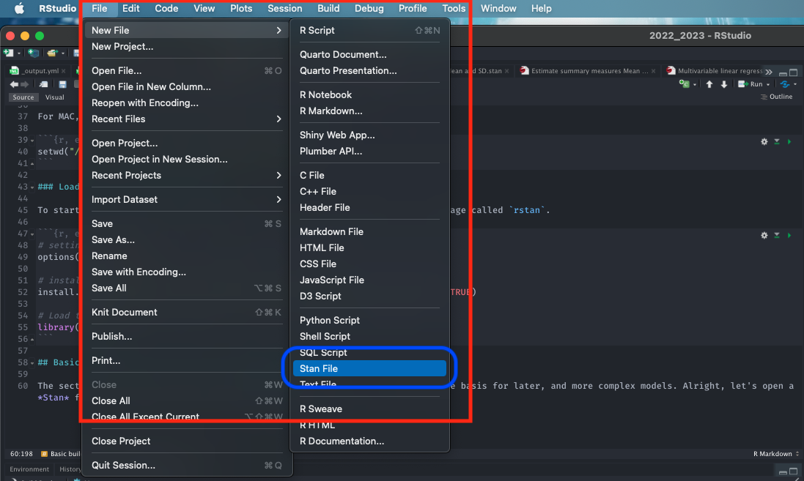
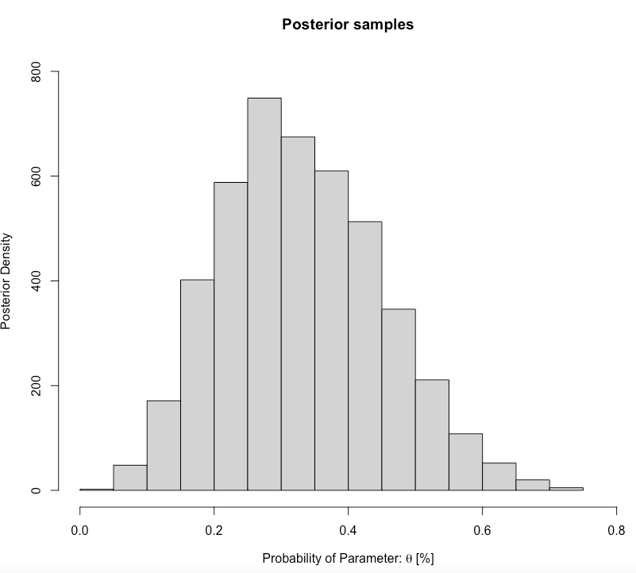
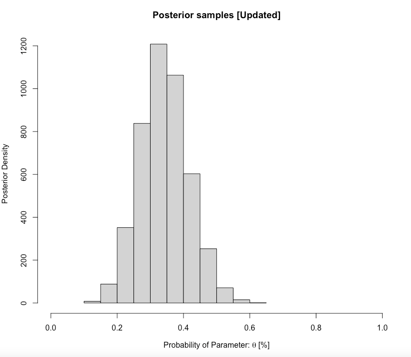

# Introduction to Bayesian Inference

## Lecture recording (Length: 1:00:02 minutes)
```{r, warnings=FALSE, message=FALSE, echo=FALSE}
library(vembedr)
embed_youtube('iWT6Ly1Gewo', height=400) %>% use_align('center')
```
[[**Watch on YouTube**]](https://youtu.be/iWT6Ly1Gewo)

## Introduction

In this week you will be introduced to Bayesian Statistics. It is a branch of statistics which applies probabilities to statistical problems. The core of Bayesian Statistics is the application of **Bayes’ Theorem (or Bayes’ Rule)** which uses conditional probabilities to quantify uncertainty outcome. We are going to show you how one can use [**Stan**](https://mc-stan.org) to encode probabilities to a statistical model (aka likelihood functions) to perform full **Bayesian inference**.

### Learning outcomes

Today’s session aims to introduce you to the basic Stan programming etiquette for Bayesian analysis in RStudio using Stan as an Interface, and producing output and interpreting it's results. By the end of this session, you should be able to perform the following:

1. Develop basic Stan code
2. Know how to write and compile a Stan Program to compute the **posterior distribution** for simple parameters (i.e., mean, standard deviation, a proportion etc.,)
3. Know how to interpret the results churned from a Stan HMC simulation run

You can follow the live walkthrough demonstration delivered in the first 1-hour of the practical, and then use the remaining half to try the practical tutorials and follow the instructions on your own.

### Demonstration recording (Length: 1:59:50 minutes)
```{r, warnings=FALSE, message=FALSE, echo=FALSE}
library(vembedr)
embed_youtube('myEsN_p7BfQ', height=400) %>% use_align('center')
```
[[**Watch on YouTube**]](https://youtu.be/myEsN_p7BfQ)

### Datasets & setting up the work directory 

Since, this is our first practical lesson for GEOG0125, let us create a new folder **GEOG0125** at the desktop location of our computer. Now, create a sub folder called "**Week 1**" within the **GEOG0125** folder. Here, we will store all our R and Stan scripts. Set your work directory to **Week 1's** folder.

For Windows, the code for setting the work directory will be:

```{r, eval = FALSE}
setwd("C:/Users/AccountName/Desktop/GEOG0125/Week 1")
```

For MAC, the code for setting the work directory will be:

```{r, eval = FALSE}
setwd("/Users/AccountName/Desktop/GEOG0125/Week 1")
```

### Loading the appropriate packages

Let us load the installed package called `rstan`.

```{r, eval = FALSE}
# Load the packages with library()
library('rstan')
```

Note that when you load `rstan` from cran you will see some recommendations on using multiple cores for speeding the process. For the best experience, we highly recommend using this code:

```{r, eval=FALSE}
options(mc.cores = parallel::detectCores())
rstan_options(auto_write = TRUE)
```

This tells RStudio to use multiple core for parallel process whenever Stan is being implemented. Every time you want to use Stan - make sure to load `parallel::detectCores()` and `rstan_options` code.

## Basic building blocks I: About Stan Programming

The section describes how to code up a basic Stan model. This section forms the basis for later, and more complex models. 

### Opening a Stan Script in RStudio

Alright, let's open a **Stan** file. You can do this by clicking and selecting `File` > `New File` > `Stan File` 

```{r echo=FALSE, out.width = "100%", fig.align='center', cache=TRUE,}
 
```

When you open a new **Stan** file, you will be greeted with an `untitled script` which contains the following bits of code:

```{r, eval=FALSE, highlight=FALSE}
//
// This Stan program defines a simple model, with a
// vector of values 'y' modeled as normally distributed
// with mean 'mu' and standard deviation 'sigma'.
//
// Learn more about model development with Stan at:
//
//    http://mc-stan.org/users/interfaces/rstan.html
//    https://github.com/stan-dev/rstan/wiki/RStan-Getting-Started
//

// The input data is a vector 'y' of length 'N'.
data {
  int<lower=0> N;
  vector[N] y;
}

// The parameters accepted by the model. Our model
// accepts two parameters 'mu' and 'sigma'.
parameters {
  real mu;
  real<lower=0> sigma;
}

// The model to be estimated. We model the output
// 'y' to be normally distributed with mean 'mu'
// and standard deviation 'sigma'.
model {
  y ~ normal(mu, sigma);
}

```

Do not worry about that - it is just formalities by the developers behind `rstan`. You can delete everything you see in this script as we will build our own basic script from scratch. 

Once you have deleted the default information save the empty file in the **Week 1** folder naming it `Predicting a proportion.stan`. Whenever you are saving Stan programme in RStudio always make sure to save it with a `.stan` ending. 

### Basic structure of a Stan script in RStudio

A typical **Stan** program consist of the following 6 **blocks**:

1. Data
2. Transformed data
3. Parameters
4. Transformed parameters
5. Model
6. Generated quantities

Out of these 6 blocks, the `Data`, `Parameters` and `Model` block **must** be specified. These are three compulsory blocks needed in any Stan script in order for a Bayesian model to work within the `rstan` environment. Let us define what these three important blocks are.

**FIRST:** The **data block** allows the user to declare how the model reads the dataset from RStudio by specifying the sample size **N** or observations; the number of **k** parameters that needs to be estimated; the names or list of independent variables for the corresponding parameters (e.g., coefficients); as well as data constraints etc., A **data** block is specified accordingly as:

```{r, eval=FALSE, highlight=FALSE}
data {

}

```

It is within these curly brackets will specify these details of our dataset. They must be precise as it will have to correspond with the data that is loaded in RStudio's memory.

**SECOND:** The **parameters block** allows the use to declare all primitive unknown quantities, including their respective storage types, dimensions, and constraints. The parameters that go here are the ones we want to infer or predict - e.g., includes the `mean`, `variance`, `sd`, `coefficient` and many more. A **parameters** block is specified after the **data** block:

```{r, eval=FALSE, highlight=FALSE}
data {

}

parameters {
	
}

```

**THIRD:** The **model block** allows the use to declare and specify the sampling statements for the **dependent variable** (i.e., likelihood function) and parameters (i.e., priors) to be used in the model. A **model** block is specified after the **parameters** block:

```{r, eval=FALSE, highlight=FALSE}
data {

}

parameters {
	
}

model {
	
}

```

Note that adding a double forward slashes ``//`` lets the user add a comment to script. Let add comments to the blocks:


```{r, eval=FALSE, highlight=FALSE}
// Add comments after double forward slashes 

data {
	// data block

}

parameters {
	// parameters block
	
}

model {
	// model block
	
}

```

<div class="note">
**Important Notes:** Since, the other blocks are not compulsory - we will leave them out for now. But we will come back and explain what those remaining blocks are in **Week 2 and 3**. Now, save your Stan script.
</div>

## Basic building blocks II: Data types and constraint declarations

In Stan, all parameters and data must be defined as variables with a specific type. Note, this quite a pain but going through this step allows `rstan` to perform really fast. There are four basic **data** types: 

1. `int`: for integers, used for specifying the sample size, and is applied to discrete variables
2. `real`: for continuous, is applied to continuous variables (i.e., ratio or interval) 
3. `vector`: for a column vector of `reals` 
4. `matrix`: for a matrix of `reals`

For **constraints**, we specify them on variables. For example, if we are dealing with a proportion **p** we will code it as `real<lower=0, upper=1> p` tells Stan that **p** can be any value from 0 to 1, inclusive. Note that specifying constraints really help speed Stan up so use them wherever possible.

Lastly, you can create **arrays** of variables. For example, `real p[10]` tells Stan that **p** is an array of 10 real values. We can also create a matrix to represent a set of independent variables. Now that we have discussed these points - let work with an actual demonstration to show **data types** and **constraints** work.

## Basic building blocks III: Developing our model

<div class="note">
**PROBLEM:** In 2021/2022, the GEOG0125 course, there was 13 students enrolled. It was Anwar's first time being a teacher on the course, and hence was quite curious to know what proportion of students who will pass with a distinction (70%+). Since, he had no data on the pass rates. He had no **prior knowledge**. First, he assumes that the **proportion of those passing with a distinction** came from a **Beta distribution** that mimics a uniform **Beta(1.0, 1.0)**. In term 3, after tedious marking of reports, he observes that 4 students (out of the total: 13) passed with flying colours. What is the posterior distribution of those getting a distinction for GEOG0125? 
</div>

Let us build our first model that predicts the posterior distribution of those passing GEOG0125 with a distinction. In this simple for modelling proportions (or prevalence), we extract our information:

- Total sample size is 13 (N)
- Number of students who passed (70% and above) is 4 (p)
- **Data**: Proportion (or prevalence) of distinction grades is 4/13, but this is just one instance (it could have been these other likely outcomes: 0/13, 1/13, 2/13, 3/13, 4/13, ..., 12/13 or even 13/13). Let us represent proportion of distinction grades with some probability distribution $\theta$ which has a **Binomial distribution** (likelihood function).
- There is no prior knowledge, but we are dealing with a **proportion** here so a **Beta distribution** is best for this problem. We are assuming that it has uniform pattern i.e., **Beta(1.0, 1.0)** because all these instance (i.e., 0/13, 1/13, 2/13, 3/13, 4/13, ..., 12/13 or even 13/13) have a equal chance of happening. This is an example of an **uninformative prior**

We can code this information in Stan. 

**FIRST:** We specify the total number of student as integer `int N` which cannot be a negative number in the **data** block. Also, we also need to specify the number of students that passed as an integer `int p` which cannot be a negative number in the **data** block too.

```{r, eval=FALSE, highlight=FALSE}
data {
	int<lower = 0> N;
	int<lower = 0> p;
}
```

**SECOND:** For the **parameters** block, here we will need to specify the name of the parameter that we want to infer. Here, its $\theta$ which is the **proportion** of those who got a distinction in GEOG0125. Note that $\theta$ follows a beta distribution and is therefore translated as a probability as a `real` value that is within the range of 0 to 1, inclusive.

```{r, eval=FALSE, highlight=FALSE}
data {
	int<lower = 0> N;
	int<lower = 0> p;
}

parameters {
	real<lower=0, upper=1> theta;
}

```

**THIRD:** For the **model** block, here we will need to define our **posterior distributions**. Here, we need to state that **p** likelihood function is sampled from a **binomial distribution** as a function of **N** and $\theta$ (`binomial(N, theta)`). We also have to say $\theta$ is sampled from a **beta distribution** that is uniform. The model block will be:

```{r, eval=FALSE, highlight=FALSE}

data {
	int<lower = 0> N;
	int<lower = 0> p;
}

parameters {
	real<lower=0, upper=1> theta;
}

model {
	p ~ binomial(N, theta); // our likelihood function or observation model
	theta ~ beta(1.0, 1.0); // our prior distribution alpha = 1 and beta = 1
}

```

<div class="note">
**COMPLIMENTS:** Well done, we have built our first Bayesian model. Let save it the script, what we need to do is compile and run it through RStudio to get our results. 
</div>

## Basic building blocks IV: Compiling our Stan code in RStudio

Now, let us turn our attention to RStudio. The Stan script needs to be compiled from an R script. We will first need to create a list object using `list()` to connect the data to the information specified in the **data** before running the function `stan()` to the Bayesian model to get the results. The **N** and **p** will need to defined in the list object. 

```{r, eval = FALSE}
# create list object and call it dataset
dataset <- list(N = 13, p = 4)
```

Now, using the `stan()` to compile and obtain the posterior estimation of the proportions of students passing with a distinction:

```{r, eval = FALSE}
# the directory needs to be set to where you save the datasets and Stan script
prediction.passes = stan("Predicting a proportion.stan", data=dataset, iter=3000, chains=3, verbose = FALSE)
```

Some notes on the above code's arguments:

- `data=` we are pushing the data we created from the `list()` to the Stan script. Stan is  calling it.
- `iter=` we are asking the `stan()` to perform 3,000 iterations on each chain to generate the posterior samples. The chain can be a **MCMC**, **NUTS** or **HMC** algorithm (**NUTS** No-U-turn sampler is the default)
- `chains=` we are asking the `stan()` function to perform 3 chains (i.e., any of these algorithms can be stated in the function: i.e., **MCMC**, **NUTS** & **HMC**)

The resulting output can be printed with the function `print()`. Here, we are going to print the mean, standard error in mean, SD and the IQR ranges with 95% limits (i.e., 2.5% and 97.5%):

```{r, eval=FALSE}
print(prediction.passes, probs=c(0.025, 0.25, 0.5, 0.75, 0.975))
```

We obtain this summary table:


```{r, eval=FALSE, highlight=FALSE}
Inference for Stan model: Predicting a proportion.
3 chains, each with iter=3000; warmup=1500; thin=1; 
post-warmup draws per chain=1500, total post-warmup draws=4500.

        mean se_mean   sd   2.5%    25%   50%   75% 97.5% n_eff Rhat
theta   0.33    0.00 0.12   0.12   0.24  0.32  0.41  0.58  1495    1
lp__  -10.08    0.02 0.73 -12.21 -10.26 -9.80 -9.61 -9.55  1879    1

Samples were drawn using NUTS(diag_e) at Thu Jan 12 14:39:10 2023.
For each parameter, n_eff is a crude measure of effective sample size,
and Rhat is the potential scale reduction factor on split chains (at 
convergence, Rhat=1).
```

<div class="note">
**What does it all mean?** The top part states that 3 chains were run for 3000 iterations. However, the first 1500 samples generated from each chain were discarded as warm-up, meaning that only 1500 samples from each chain were kept, resulting 4500 (1500x3) total post-warm-up sample draws. The output shows the summary statistics for our $\theta$. The `lp__` is the log-probability - which is used to quantify how well the model is for the data but, in my opinion, its not a useful estimate. Instead, use the effective sample size `n_eff` and `Rhat`. If the `Rhat` is less than 1.05 for **All** parameters - it means that the estimation of our parameters are fine.   
</div>

## Basic building blocks V: Extract posterior samples and interpretation

At this point, let us extract the posterior samples and graph them to understand it posterior distribution. We use the `extract()` function from the `rstan` package, and graph them:

```{r, eval=FALSE}
# extracting the samples (it should be 4500)
theta.pass_draws <- extract(prediction.passes, 'theta')[[1]]
# create a graph i.e., histogram
hist(theta.pass_draws, xlim = c(0,0.8), ylim = c(0,800), 
	main= "Posterior samples", ylab = "Posterior Density (Plausibility)", xlab = expression(paste("Pass rate > 70%: ", theta, " [%]")))
```

```{r echo=FALSE, out.width = "100%", fig.align='center', cache=TRUE}
 
```

You can also plot the density as opposed to generating a histogram:

```{r, eval=FALSE}
plot(density(theta.pass_draws), 
	main = "", 
	xlab = expression(paste("Pass rate > 70%: ", theta, " [%]")), 
	ylab = "Posterior Density (Plausibility)")
```

We want to compute the posterior mean, with the 0.025 and 0.975 quantiles (these limits are referred to as **95% credibility limits (95% CrI)**). Here is how we compute them:

```{r, eval=FALSE, highlight=FALSE}
# Calculating posterior mean (estimator)
mean(theta.pass_draws)

# Calculating posterior intervals
quantile(theta.pass_draws, probs=c(0.025, 0.975))
```

<div class="note">
**Interpretation:** The predicted proportion of students passing the GEOG0125 with 70%+ from our sample posterior distribution was 0.3305 (33.05%). This means that 33% is the most plausible pass rate. Our predictions, with 95% credibility, can be within the limits of 0.1239 and 0.5801. Formally writing as $\theta$ = 33.05% (95% CrI: 12.39-58.01%).
</div>

We have predicted the most plausible value for pass rate. We can translate this into probability terms. For instance, by asking: "What is the probability that 33% of the students on GEOG0125 will pass with a distinction (70%+)?". We can use this posterior distribution to make this estimation simply by calculating the mean our samples that is above 0.33. This is known as **Exceedance Probability**:

```{r, eval=FALSE}
# what is the probability observing a pass rate for distinction 70%+?
mean(theta.pass_draws >= 0.333)
[1] 0.4824444

# # what is the probability observing a 33% pass rate for distinction 70%+?
mean(theta.pass_draws >= 0.50)
[1] 0.09333333
```

<div class="note">
**Interpretation:** The probability for observing a pass rate of 33% for distinction on GEOG0125 was 48%. It was less likely for half the number of students getting a distinction because the chance were 9.3%.
</div>

## Basic building blocks VI: Updating our prediction with new information

What about if I receive a new cohort of students in 2022/23. The excellent thing about Bayesian statistics is its ability to update results as new information or data comes - this technique is known as **Bayesian Updating**. This technique let's you use the same script and self calibrates the new prior from the previous result. For instance, we predicted `0.3305` as the most plausible value for people to get a distinction. So the `beta()` specification will be `Beta(5, 10)` centred on 0.33 and not uniform. We can use past result and data, with the new information to fine tune the prediction, and watch as the results evolve. 

Let's have a quick go at updating this prediction with new data. Let's see:

- Total sample size is now 26 students in 2022/23 (N)
- This time around 9 scored a distinction (p)

Let us represent the proportion of distinction grades with some probability distribution $\theta$ with a **Binomial distribution** (likelihood function) [Binomial(26, 9)].
- We have prior knowledge of last year's **proportion** (0.3305) which has a **Beta distribution** [Beta(5, 10)] - this is our new **informative prior**
- Let updates the codes:

**Updated dataset in our RScript**

```{r, eval=FALSE}
dataset.updated <- list(N=26, p=9)
```

All we need to do is run the `stan()` function in R with out new dataset and the old model i.e., `prediction.passes` specified in the arguments.

**Obtaining updated posterior samples by compiling new Stan script**

```{r, eval=FALSE}
prediction.passes.updated = stan(fit=prediction.passes, data=dataset.updated, iter=3000, chains=3, verbose = FALSE)
print(prediction.passes.updated, probs=c(0.025, 0.25, 0.5, 0.75, 0.975))
```

**Updated output summary table**

```{r, eval=FALSE, highlight=FALSE}
Inference for Stan model: anon_model.
3 chains, each with iter=3000; warmup=1500; thin=1; 
post-warmup draws per chain=1500, total post-warmup draws=4500.

        mean se_mean   sd   2.5%    25%    50%    75%  97.5% n_eff Rhat
theta   0.36    0.00 0.09   0.20   0.30   0.36   0.42   0.54  1734    1
lp__  -18.74    0.02 0.69 -20.61 -18.91 -18.48 -18.30 -18.25  2017    1

Samples were drawn using NUTS(diag_e) at Fri Jan 17 10:21:26 2025.
For each parameter, n_eff is a crude measure of effective sample size,
and Rhat is the potential scale reduction factor on split chains (at 
convergence, Rhat=1).
```

**Histogram of posterior samples' distribution**

```{r, eval=FALSE}
# extracting the samples (it should be 4500)
theta.pass_draws.new <- extract(prediction.passes.updated, 'theta')[[1]] 

# create a graph i.e., histogram
hist(theta.pass_draws.new, xlim = c(0,1), 
	main= "Posterior samples [Updated]", ylab = "Posterior Density (Plausibility)", xlab = expression(paste("Pass rate (Distinction) Parameter: ", theta, " [%]")))

# create a graph i.e., density
plot(density(theta.pass_draws.new), main = "", xlab = expression(paste("Pass rate > 70%: ", theta, " [%]")) , ylab = "Posterior Density (Plausibility)")
```

```{r echo=FALSE, out.width = "100%", fig.align='center', cache=TRUE}
 
```

**Obtain updated posterior proportion and 95% CrI**

```{r, eval=FALSE, highlight=FALSE}
# Calculating posterior mean (estimator)
mean(theta.pass_draws.new)

[1] 0.3587437

# Calculating posterior intervals
quantile(theta.pass_draws.new, probs=c(0.025, 0.975))
			2.5%     97.5% 
0.2027673 0.4935101
```

<div class="note">
**Interpretation:** For the current cohort, the predicted proportion of students passing the GEOG0125 with a distinction from our updated posterior distribution was 0.3587 (36%). Our predictions, with 95% credibility, can be within the limits of 0.2027 and 0.4935. We can formally write this as $\theta$ = 35.87% (95% CrI: 20.27-49.35%).
</div>

## Tasks

### Task 1 - Low-level arsenic poisoning in Cornwall, UK

**Try this first problem in Stan**: Suppose, in a small survey, a random sample of 50 villagers from a large population in Cornwall were at risk of arsenic poisoning due to long-term low-level environmental exposure status were selected. Each person’s disease status (i.e., metallic toxicity) was recorded as either **Diseased** or **None**. 19 of the respondents have found to be diseased. The distribution of the prevalence is assumed to be of a Beta distribution with **Beta(3,5)**. 

What is the predicted posterior prevalence of arsenic poisoning in Cornwall and its 95% Credibility intervals?

### Task 2 - Body mass index (BMI) problem

**Try this second problem in Stan**: The mean BMI value is 23 with SD of 1.2. Simulate sample of 1000 with BMI values based on this distribution `N(23, 1.2)` and perform Bayesian inference. 

What is the posterior mean BMI and its 95% Credibility intervals?

**Hints:**

1. In the R script, use the function `rnorm()` to generate your sample of 1000 BMI points
2. In the R script, create a `list()` with `N` and `bmi` defined
3. In the Stan script, define the data block in accordance to the `list()` object
4. In the Stan script, the `bmi` values are measured outcome. Code this in the model block as a likelihood function using the `norm(mu, sigma)` notation
5. In the Stan script, use the parameter block, and make sure to code your `mu` (mean) and `sigma` (standard deviation) as real (non-negative) numbers 

<div class="note">
**Note:** Solutions for task 1 and 2 will be made available later today
</div>