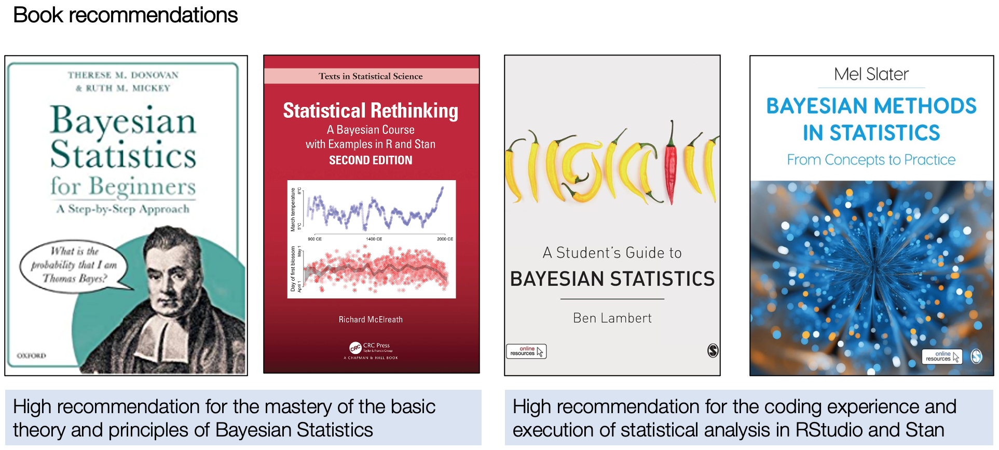

# Reading List for GEOG0125 {-}

```{r echo=FALSE, out.width = "100%", fig.align='center', cache=TRUE,}

```

Contact me via email (**a.musah@ucl.ac.uk**) if you are having problems securing one or any of these recommended books from the UCL library or elsewhere. You can access some of the share reading materials [**[HERE]**](https://drive.google.com/drive/folders/1jxzwkulTuPhfOWApzprqVfy31RjyI-2X?usp=share_link)

## Week 1: Introduction to Bayesian Inference {-}

1. **Book**: [Theory] Slater, M. (2022). Bayesian Methods in Statistics: From Concepts to Practice. **Chapters 1: Probability**. Pages 1-15.

2. **Book**: [Theory] Slater, M. (2022). Bayesian Methods in Statistics: From Concepts to Practice. **Chapters 2: Probability Distributions (Section: Some common distributions)**. Pages 24-45.

3. **Book**: [Theory] Donovan, T.M., & Mickey, R.M. (2019). Bayesian Statistics for Beginners: A Step-by-Step Approach. **Chapters 3: Bayes' Theorem**. Pages 29-36.

4. **Book**: [Theory] Graham, A. (1994). Statistics. **Chapters 13: Probability Models**. Pages 226-251.

5. **Article**: [About Stan] Carpenter, B., Gelman, A., _et al_ (2019). `Stan`: A Probabilistic Programming Language. **J Stat Soft**. DOI: [**10.18637/jss.v076.i01**](https://doi.org/10.18637%2Fjss.v076.i01).

6. **Book**: [Stan programming] Lambert, B. (2018). A Student's Guide to Bayesian Statistics. **Chapters 16: Stan**.

## Week 2: Bayesian Generalised Linear Models (GLMs) {-}

1. **Book**: [Theory] Slater, M. (2022). Bayesian Methods in Statistics: From Concepts to Practice. **Chapters 5: General Models**. Pages 114-151.

2. **Article**: [About regression models and formulation] Baldwin, S.A., & Larson, M.J. (2017). An introduction to using Bayesian linear regression with clinical data. **Behaviour Research and Therapy**. 98:58-75. DOI: [**10.1016/j.brat.2016.12.016**](https://doi.org/10.1016/j.brat.2016.12.016).

3. **Book**: [Theory] Gelman, A _et al_. (2014). Bayesian Data Analysis (3rd Edition).**Chapters 14: Introduction to Regression Models**. Pages 353-378.

## Week 3: Bayesian Generalised Additive Models (GAMs) {-}

1. **Online**: [Tutorial]. Fitting GAMs with brms: Part 1 a Simple GAM. LINK: https://fromthebottomoftheheap.net/2018/04/21/fitting-gams-with-brms/

2. **Online**: [Tutorial] Chapter 2: Interpreting and Visualizing GAMs. LINK: https://noamross.github.io/gams-in-r-course/chapter2

3. **Book**: [Theory] Wood, S.N. (2017). Generalized Additive Models: An Introduction with R (2nd Edition). **Chapter 4: Introducing GAMs**. Pages 161-191.

4. **Book**: [Theory and Applications] Wood, S.N. (2017). Generalized Additive Models: An Introduction with R (2nd Edition). **Chapter 7: GAMs in Practice**. Pages 325-398.

## Week 7: Bayesian Hierarchical Regression Models {-}

1. **Article**: [Tutorial in Stan] Sorensen, T., & Vasishth, S. (2016). Bayesian linear mixed models using Stan: A tutorial for psychologists, linguists, and cognitive scientists. **Tutorials in Quantitative Methods for Psychology**. 12(3):175-200. DOI: [**10.20982/tqmp.12.3.p175**](https://www.tqmp.org/RegularArticles/vol12-3/p175/p175.pdf)

2. **Book**: [Theory] Gelman, A _et al_. (2014). Bayesian Data Analysis (3rd Edition).**Chapters 15: Hierarchical Linear Models**. Pages 381-402.

## Week 8: Spatial Intrinsic Conditional Autoregressive Modelling (ICAR) {-}

1. **Article**: [Methodology] Li, L. _et al_ (2022). An ecological study exploring the geospatial associations between socioeconomic deprivation and fire-related dwelling casualties in the England (2010–2019). **Applied Geography**. 144(1027718). DOI: [**10.1016/j.apgeog.2022.102718**](https://doi.org/10.1016/j.apgeog.2022.102718).

2. **Article**: [Theory] Morris, M. _et al_ (2019). Bayesian hierarchical spatial models: Implementing the Besag York Mollié model in stan. **Spatial and Spatio-temporal Epidemiology**. 31(100301). DOI: [**10.1016/j.sste.2019.100301 **](https://doi.org/10.1016/j.sste.2019.100301)

3. **Online Tutorials**: [Stan Programming] Morris, M. _et al_ (2019). Spatial Models in Stan: Intrinsic Auto-Regressive Models for Areal Data. URL: https://mc-stan.org/users/documentation/case-studies/icar_stan.html

4. **Article**: [Methodology] Gomez, M.J. _et al_ (2023). Bayesian spatial modeling of childhood overweight and obesity prevalence in Costa Rica. **BMC Public Health**. 23(651). DOI:[**10.1186/s12889-023-15486-1**](https://doi.org/10.1186/s12889-023-15486-1)

5. **Article**: [History] Besag, J. (1974). Spatial interaction and the statistical analysis of lattice systems. **Journal of the Royal Statistical Society**. Series B (Methodological) (1974): 192-236.

6. **Article**: [History] Besag, J. & Kooperberg, K. (1995) “On conditional and intrinsic autoregression. **Biometrika**. 733-746.

7. **Article**: [History, how the ICAR model was improved] Riebler, A., _et al_ (2016). An intuitive Bayesian spatial model for disease mapping that accounts for scaling. **Statistical methods in medical research**. 25(4): 1145-1165. DOI: [**10.1177/0962280216660421**](https://doi.org/10.1177/0962280216660421)

## Week 9: Bayesian Updating and Spatiotemporal Modelling {-}

1. **Book**: [R-INLA Tutorials] Moraga, P. (2020). Geospatial Health Data: Modeling and Vizualisation with R-INLA and Shiny. **Chapters 5: Areal Data**. Pages 53-74.

2. **Book**: [R-INLA Tutorials] Moraga, P. (2020). Geospatial Health Data: Modeling and Vizualisation with R-INLA and Shiny. **Chapters 6: Spatial modeling of areal. Lip cancer in Scotland**. Pages 75-88.

3. **Book**: [R-INLA Tutorials] Moraga, P. (2020). Geospatial Health Data: Modeling and Vizualisation with R-INLA and Shiny. **Chapters 7: Spatio-temporal modeling of areal data. Lung cancer in Ohio**. Pages 93-108.

4. **Book**: [R-INLA Methodology] Blangiardo, M, & Cameletti, M. (2015). Spatial and Spatio-temporal Bayesian Models in R-INLA. **Chapters 6: Spatial modeling**. Sections 6.1-6.3, Pages 173-192.

5. **Book**: [R-INLA Methodology] Blangiardo, M, & Cameletti, M. (2015). Spatial and Spatio-temporal Bayesian Models in R-INLA. **Chapters 7: Spatio-temporal models**. Sections 7.1-7.2, Pages 253-258.

## Week 10: Study Design, Research Methodology & Revision {-}

[**Not Applicable**]

## Excellent & Incredibly Useful Tutorial Videos for Learning Stan Code {-}

1. Bayesian Inference with Stan Episode 1: Motivation [**[Video]**](https://youtu.be/ZVri1VgK54U?si=_YQk8AvMjP1hVSI6)
2. Bayesian Inference with Stan Episode 2: Theory and concepts [**[Video]**](https://www.youtube.com/watch?v=S-qU3lUG6Ck)
3. Bayesian Inference with Stan Episode 3: Linear Regression [**[Video]**](https://youtu.be/BeBkFKKhel4?si=Ik2Kkge8lmTe0Akv)
4. Bayesian Inference with Stan Episode 4: Logistic Regression [**[Video]**](https://youtu.be/LFPMrCYcT-M?si=K0LumJqnzo84142y)

## 4-Day Summer Workshop: Introduction to Bayesian Inference and Modelling [2022/23] {-}

UCL SODA CPD Workshop [**[SOURCE]**](https://uclpg-msc-sgds.github.io/UCL-SODA-CPD-RStan/)

1. Day 1: Introduction to Bayesian Inference using Stan [**[Lecture Video]**](https://www.youtube.com/watch?v=P0XttSki1jQ) [**[Live Demonstration]**](https://www.youtube.com/watch?v=N_P_EtT1MZk)
2. Day 2: Bayesian Generalised Linear Models using Stan [**[Lecture Video]**](https://www.youtube.com/watch?v=BXuppKiEHXU) [**[Live Demonstration]**](https://www.youtube.com/watch?v=cE9DEZAZnsY)
3. Day 3: Bayesian Generalised Hierarchical Regression Models [**[Lecture Video (Part 1)]**](https://www.youtube.com/watch?v=hP86-T_k38k)[**[Lecture Video (Part 2)]**](https://www.youtube.com/watch?v=r1RPPAtFV0w)[**[Live Demonstration]**](https://www.youtube.com/watch?v=DFi_ao4TbAQ)
4. Day 4: Bayesian Spatial Modelling for Areal Data in Stan [**[Lecture Video]**](https://www.youtube.com/watch?v=IIFOwxtfuPU) [**[Live Demonstration]**](https://www.youtube.com/watch?v=bEzTC5WbBIA)
