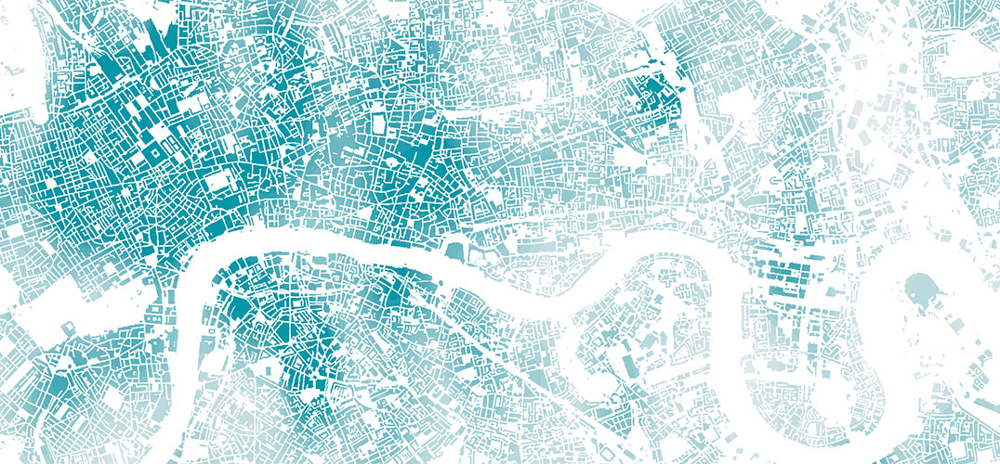

--- 
title: "GEOG0125: Advanced Topics in Social Geographic Data Science"
site: bookdown::bookdown_site
output: bookdown::gitbook
documentclass: book
link-citations: yes
github-repo: "UCLPG-MSC-SGDS/GEOG0125"
description: "GEOG0125: Advanced Topics in Social Geographic Data Science Handbook"
bibliography: [book.bib, packages.bib]
---

# Welcome {-}

```{r echo=FALSE, out.width = "100%", fig.align='center', cache=TRUE,}
 
```
<br />

Welcome to **GEOG0125: Advanced Topics in Social Geographic Data Science**, one of the optional modules for this MSc programme ([**Social and Geographic Data Science**](https://www.geog.ucl.ac.uk/study/graduate-taught/msc-social-and-geographic-data-science)). This module has been designed as an advanced topics module to learn data science concepts and methods, and to apply them in the domains of social science and geography. The module will introduce concepts such as statistical inference and machine learning methodologies.

In the first three weeks, you will be introduced to **descriptive** and **inferential statistical techniques** in RStudio. Afterwards, in week 4, 5 and 6, we will cover a variety of unique machine learning techniques which includes **Deep Learning**, **Convolutional Neural Networks** and **GeoAI** in Python. In week 7, 8, 9 and 10, we will introduced to **Bayesian statistics using INLA** to get perform geospatial analysis of point, areal and raster data. This will cover **Spatial Temporal Modelling** as well as **SPDE-INLA**. Lastly, you will gain the practical skills for building dashboards for **Web & Geo-visualisation using R-Shiny**.

## Moodle {-}

All practical materials including reading lists and downloadable data sets will be hosted on this webpage. The lecture materials, including live stream recordings will be on [**Moodle**](https://moodle.ucl.ac.uk/). 

**Moodle** is the central point of your learning experience for **GEOG0125** and contains everything you need to know about the schedule for weekly topics and assessment. Do check Moodle on a regular basis for any important updates.

## Structure {-}

All lectures and computer practicals are in-person. The computer lessons are delivered a day before the lectures. All computer lab seminars will be delivered on Thursday from 09:00am to 11:00am at the [**Cruciform Building (Room B1.15A)**](https://www.ucl.ac.uk/maps/cruciform-building).  All Lectures are held on Friday from 11:00am to 12:00pm at the [**North West Wing (Room 305)**](https://www.ucl.ac.uk/maps/north-west-wing-building).

## Office hours for GEOG0125 {-}

- Office hours with Dr Anwar Musah (Fridays between 14h00 and 15h00) can be booked [**here**](https://outlook.office365.com/owa/calendar/AnwarMusahBookableOfficeHours@ucl.ac.uk/bookings/). 

- Office hours with Lan Li (Tuesdays between 12h00 and 14h00)

Feel free to drop-by in-person at our offices for additional support. Our contact information and office details are:

**Dr Anwar Musah**
<br/>
UCL Department of Geography 
<br/>
Room 115, North West Wing Building, WC1E 6BT
<br/>
Email: [**a.musah@ucl.ac.uk**](a.musah@ucl.ac.uk)

**Lan Li**
<br/>
UCL Institute for Risk & Disaster Reduction
<br/>
Room 32a, Centre for Digital Public Health & Emergencies
<br/>
[**2nd Floor, South Wing Building, WC1E 6BT**](http://www.ucl.ac.uk/maps/south-wing)
<br/>
Email: [**lan.li.19@ucl.ac.uk**](**lan.li.19@ucl.ac.uk**)