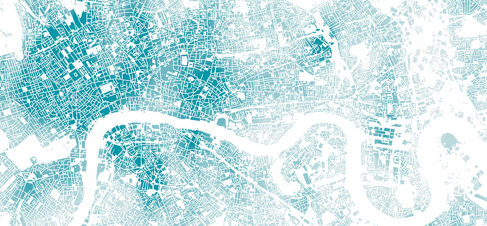

--- 
title: "GEOG0125: Advanced Topics in Social Geographic Data Science"
site: bookdown::bookdown_site
output: bookdown::gitbook
documentclass: book
github-repo: "UCLPG-MSC-SGDS/GEOG0125"
description: "GEOG0125: Advanced Topics in Social Geographic Data Science Handbook"
---

# Welcome {-}

```{r echo=FALSE, out.width = "100%", fig.align='center', cache=TRUE,}
 
```
<br />

Welcome to **GEOG0125: Advanced Topics in Social Geographic Data Science**, one of the core term two modules for this MSc programme ([**Social and Geographic Data Science**](https://www.geog.ucl.ac.uk/study/graduate-taught/msc-social-and-geographic-data-science)). This module has been designed as an advanced topics module to learn data science concepts and methods, and to apply them in the domains of social science and geography. The module will introduce concepts such as **Bayesian inference** and **Machine Learning methodologies**.

## Description {-}

This particular facet in the advanced topics course aims to cover an **Introduction to Bayesian statistics** in RStudio using [**Stan**](https://mc-stan.org), which is an interface to RStudio that allows state-of-the-art statistical modelling and Bayesian computation. We will introduce you to the absolute basics of writing your own probabilistic codes for carrying out a broad range of multivariable models within the Bayesian framework: **Generalised Linear Modelling (GLMs)**; **Hierarchical Models**; and **Generalized Additive Models (GAMs)**. Thereafter, you will be shown how to create **Spatial & Spatiotemporal Bayesian models** using **Conditional Autoregression (CARs)** for risk prediction and uncertainty using **exceedance probabilities**, which have significant applications to many fields such as **spatial epidemiology**, **social sciences**, or **disaster risk reduction** and many more.

All lecture notes, recommended reading and seminar learning materials as well as supplementary video content developed by **Dr. Anwar Musah** will be hosted on this webpage.

You can download the lecture notes and data sets for the practical lesson from the table below.

| **Week** | **Downloads** | **Topics** |
|:----------------|:------------------------|:--------------------------------------|
|1 | [**[Lecture Notes]**](https://github.com/UCLPG-MSC-SGDS/GEOG0125/raw/main/Lecture_notes/GEOG0125%20Week%201%20Lecture%20-%20Introduction%20to%20Bayesian%20Statistics.pdf) | Introduction to Bayesian Statistics |
|2 | [**[Lecture Notes]**](https://github.com/UCLPG-MSC-SGDS/GEOG0125/raw/main/Lecture_notes/GEOG0125%20Week%202%20Lecture%20-%20Bayesian%20GLMs.pdf) [**[Datasets]**](https://github.com/UCLPG-MSC-SGDS/GEOG0125/raw/main/Dataset%20for%20Week%202.zip) | Bayesian Generalised Linear Models (GLMs) |
|3 | [**[Lecture Notes]**](https://github.com/UCLPG-MSC-SGDS/GEOG0125/raw/main/Lecture_notes/GEOG0125%20Week%203%20Lecture%20-%20Bayesian%20GAMs.pdf)  [**[Datasets]**](https://github.com/UCLPG-MSC-SGDS/GEOG0125/raw/main/Dataset%20for%20Week%203.zip) | Bayesian Generalised Additive Models (GAMs) |
|7 | [**[Lecture Notes]**](https://github.com/UCLPG-MSC-SGDS/GEOG0125/raw/main/Lecture_notes/GEOG0125%20Week%207%20Lecture%20-%20Bayesian%20Hierarchical%20Models.pdf)  [**[Datasets]**](https://github.com/UCLPG-MSC-SGDS/GEOG0125/raw/main/Dataset%20for%20Week%207.zip) | Bayesian Hierarchical Regression Models |
|8 | [**[Lecture Notes]**](https://github.com/UCLPG-MSC-SGDS/GEOG0125/raw/main/Lecture_notes/GEOG0125%20Week%208%20Lecture%20-%20Spatial%20Bayesian%20Risk%20Models.pdf)  [**[Datasets]**](https://github.com/UCLPG-MSC-SGDS/GEOG0125/raw/main/Dataset%20for%20Week%208.zip) | Bayesian Spatial Risk Models |
|9 | **[Lecture Notes]** **[Datasets]** | Spatiotemproal Modelling |
|10 | [**[Lecture Notes]**](https://github.com/UCLPG-MSC-SGDS/GEOG0125/raw/main/Lecture_notes/GEOG0125%20Week%209%20Lecture%20-%20Research%20Methodology%20and%20Study%20Design.pdf) | Study Design, Research & Revision  |

**Solutions**: [**[Week 1]**](https://github.com/UCLPG-MSC-SGDS/GEOG0125/raw/main/Week%201%20Solutions%20for%20Task%201%20and%202.zip) | **[Week 2]** | **[Week 3]** | **[Week 7]** | **[Week 8]** | **[Week 9]**

<div class = "note">
**Important note:** The solutions will be made available each week after the seminars are completed. 
</div>

## Timetable and key locations {-}

The **Lectures** are held every week in-person on **Tuesday** from 10:00am to 11:00am at the **North West Wing Building (Room G07)** [**[MAP]**](http://www.ucl.ac.uk/maps/north-west-wing-building). The **computer seminar practicals** will be at the same location from 11:00am to 01:00pm on **Friday**.

::: note
**IMPORTANT NOTE**: Please bring your own laptops with you to the computer practicals on Friday.
:::

## Contact details{-}

**Dr. Anwar Musah**
<br/>
UCL Department of Geography 
<br/>
Room 115, North West Wing Building, WC1E 6BT
<br/>
Email: [**a.musah@ucl.ac.uk**](a.musah@ucl.ac.uk)
